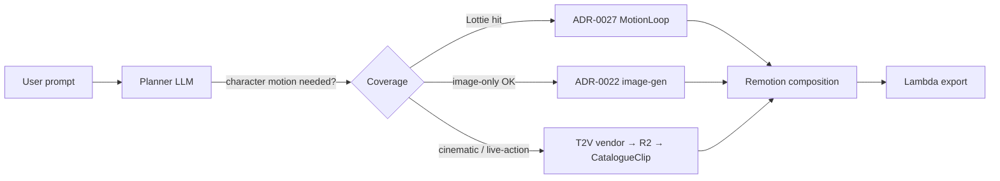

# ADR-0028 — Text-to-video hybrid: DEFER with optional single-vendor PILOT

## TL;DR

**Decision: DEFER full integration. Approve a single, time-boxed
PILOT spike against ONE vendor (recommend Runway Gen-4 Turbo) under a
hard ≤$50 budget cap, gated behind a feature flag, no production
exposure.** Full text-to-video adoption is rejected for this cycle on
three grounds: (1) cost-per-asset is 10–100× our current edit cost,
(2) sandbox/ADR-0001 compatibility requires a non-trivial wrapper
shape we have not yet specified, (3) ADR-0022 image-gen + ADR-0027
Lottie already cover the dominant living-entity motion shape at a
fraction of the cost.

## Context

TM-135 (Remotion best practices RCA + possibility-space catalogue,
`wiki/05-reports/2026-05-15-TM-135-remotion-best-practices.md`) and the
TM-140 / ADR-0027 motion-loop catalogue closed most of the
character-motion gap that TM-143 was originally intended to address.
TM-143 was scoped before that result landed; the question is now narrower:

> Given image-gen (ADR-0022) + Lottie loops (ADR-0027) + Remotion
> primitives, **is there still a residual quality gap that justifies
> integrating an external text-to-video (T2V) model**, and if so, which
> vendor and at what cost?

Constraints that any T2V integration must respect:

- **ADR-0001 (Edit ≠ Render):** the edit path must remain LLM-only.
  Calling a 30s–5min T2V job synchronously inside an edit round-trip
  would inflate latency 100×+ and break the cache model.
- **ADR-0023 (PARAMS isolation):** swapping a T2V clip cannot trigger
  an LLM round-trip; the URL must be a single PARAMS string the
  customize UI can rebind.
- **TM-123 sandbox invariant:** `<Video>` / `<OffthreadVideo>` /
  `<IFrame>` are denied at sandbox + prompt + evaluator + MCP plugin
  layers. Re-enabling them requires the same wrapper-catalogue shape
  we used for ADR-0026 audio (`<CatalogueAudio>`) and ADR-0027 motion
  (`<MotionLoop>`) — i.e. a `<CatalogueClip>` wrapper that emits the
  literal `<OffthreadVideo src={staticFile("video/<slug>.mp4")} />`
  shape internally.
- **ADR-0017 capture determinism:** Lambda render must be reproducible.
  External T2V clips are fine here (they are static once generated)
  but require the cache + R2 storage layer to be in place first.
- **ADR-0003 prompt caching:** the system prompt mentioning T2V must
  not change on every edit (cache key stability).

## Vendor landscape (May 2026 snapshot)

Pricing normalized to **per-second of generated video, API access**.
Latency / max duration / character-consistency / API openness scored
qualitatively from public docs.

| Vendor | Model | API price (per sec) | Typical 5s clip | Max dur | Latency | Char. consistency | API access |
|---|---|---|---|---|---|---|---|
| **Runway** | Gen-4 Turbo | $0.05 (5 credits/s × $0.01) | $0.25 | 10s | ~30–60s | Good (ref-image) | **Open self-serve** ([docs](https://docs.dev.runwayml.com/guides/pricing/)) |
| Runway | Gen-4.5 | ~$0.12/s ($0.60 / 5s) | $0.60 | 10s | ~60–120s | Best of Runway tier | Open self-serve |
| **Kling** | 3.0 Standard | $0.075–0.084/s | $0.38–0.42 | 10s | ~60–180s | Strong (ref-image + face) | **Enterprise-only on official; self-serve via fal.ai / EvoLink proxies** |
| Kling | 3.0 Pro | $0.112/s (no audio) | $0.56 | 10s | ~120s | Strongest of tested | Same — proxy only for self-serve |
| **OpenAI Sora 2** | Standard | $0.10–0.50/s (resolution tier) | $0.50–2.50 | 20s | ~30–120s | Good but no ref-image control yet | API live since Sep 2025; gated; consumer Plus/Pro only after 2026-01-10 for non-API |
| **Pika 2.2** (via fal.ai) | 720p | $0.04/s ($0.20 / 5s) | $0.20 | 5–10s | ~30s | Moderate | **Open via fal.ai** — cheapest self-serve |
| Pika 2.2 (via fal.ai) | 1080p | $0.09/s ($0.45 / 5s) | $0.45 | 5–10s | ~30–60s | Moderate | Open via fal.ai |
| **Luma Dream Machine** | Ray 2 | $0.08/s | $0.40 | 10s | ~30–60s | Strong (Modify/Extend) | Open self-serve via PiAPI / lumalabs |

Sources (May 2026 — see footer): Runway docs.dev.runwayml.com,
fal.ai/Pika 2.2 model card, Kling AI pricing aggregators (EvoLink / fal),
OpenAI Sora 2 pricing pages, Luma developer pricing.

### Reference: our current cost baseline

- Edit (LLM only, ADR-0001 / ADR-0003 cached): **~$0.005 / edit**.
- ADR-0022 image-gen (TM-92 bench, low tier): **$0.011 / asset**, medium $0.043, high $0.167. Latency 5–15s.
- ADR-0027 Lottie loop (curated catalogue): **$0** marginal, instant.

T2V is therefore **10× to 500× more expensive than an LLM edit and
~5× to 30× more expensive than a low-tier image gen**, for an output
shape (5–10s motion clip) that ADR-0027 covers for $0.

## Hybrid scenarios with our stack

Two integration shapes were considered, both predicated on a
**`<CatalogueClip>` wrapper** mirroring the ADR-0026 / ADR-0027 pattern:

### (a) Character-motion only — T2V for the subject, Remotion for the rest

LLM emits `<CatalogueClip src={staticFile("video/gen-<hash>.mp4")} />`
for the moving character; text overlays, transitions, UI chrome,
camera moves stay in Remotion. T2V job runs **once** at first
generation, result cached in R2 keyed by `hash(prompt + style + seed)`.
Subsequent edits reuse the cached URL — ADR-0001 / ADR-0003 preserved.

- **Pros:** preserves Remotion's strength for typography / data-viz /
  composition; T2V cost amortized over many edits.
- **Cons:** wrapper + cache + R2 lifecycle is non-trivial new infra;
  blending T2V clip into Remotion scene reveals lighting / framing
  mismatch unless we constrain T2V to neutral-background prompts.

### (b) Whole-scene T2V, Remotion composes timing only

LLM emits a `<Sequence>` of `<CatalogueClip>` nodes; Remotion is
reduced to a non-linear editor. Removes Remotion's typography /
data-viz / UI strengths from the output shape.

- **Pros:** highest visual ceiling per second.
- **Cons:** loses our differentiation (we become a thin wrapper around
  the vendor's editor); 30–60s × N clips × $0.05–0.50/s = a single
  10-scene asset can run **$5–50**, breaking the Pro $12/mo unit
  economics from ADR-0001.

Neither scenario is shippable today without the `<CatalogueClip>`
wrapper + R2 cache + a sandbox carve-out spec. None of those exist.

## ADR-0001 compatibility analysis

T2V is **compatible with ADR-0001 if and only if** generation happens
**outside the edit hot path** — i.e. either:

- **Async pre-gen at scene-spec time** (multi-step pipeline, ADR-0020),
  with the edit round-trip only seeing the resulting `staticFile`
  string. This is the same shape as ADR-0022 image-gen (already
  proven) and is workable.
- **User-initiated explicit "render this scene as video" action**
  outside the LLM loop, with a progress UI. Also workable but adds
  significant new UX surface.

A naive "LLM calls T2V synchronously in the edit response" would
violate ADR-0001 (server-side multi-second blocking call in the edit
path) and is rejected.

## Options considered

### (A) DEFER — no T2V integration this cycle (RECOMMENDED policy half)

Bet that ADR-0022 + ADR-0027 + the TM-135 Remotion technique catalogue
(motion-blur, paths, noise, transitions, R3F) close enough of the
quality gap that T2V is not the highest-ROI investment for the next
sprint. Re-evaluate after we have evidence (user complaints,
acceptance failures) that residual living-entity / cinematic prompts
are still the dominant defect class.

- **Pros:** zero new infra; preserves the unit economics from ADR-0001
  ($0.005/edit, 64% Pro margin); avoids vendor lock-in commitment
  before we know which vendor wins (the field is moving monthly).
- **Cons:** if cinematic / live-action prompts emerge as the dominant
  unmet need, we're a sprint behind competitors who already shipped
  T2V. Mitigation: the PILOT below produces evidence cheaply.

### (B) PILOT — single-vendor time-boxed spike (RECOMMENDED execution half)

Spawn a discrete, ≤$50, single-developer-week spike against
**Runway Gen-4 Turbo** (rationale below) to:

1. Build a throwaway `<CatalogueClip>` proof-of-concept (sandbox carve-out behind feature flag, NOT shipped).
2. Run **20–40 representative prompts** end-to-end, measure: actual cost, latency p50/p95, % usable output, sandbox compatibility issues, cache-key stability.
3. Compare side-by-side with the ADR-0022 + ADR-0027 baseline on the same prompts (eval: which was preferred?).
4. Produce a **GO/NO-GO follow-up ADR** with hard data, replacing this PENDING one.

**Why Runway Gen-4 Turbo specifically:**

- Cheapest fully self-serve API of the three "tier-1" quality vendors ($0.05/s vs Kling $0.075–0.11/s vs Sora $0.10–0.50/s).
- Open API key flow (no enterprise contract like Kling official, no gated rollout like Sora).
- Mature ref-image conditioning (compatible with feeding ADR-0022 image-gen output as the "first frame" — a natural hybrid we can test cheaply).
- 20 prompts × 5s × $0.05 = **$5 total spike cost** for the generation budget; even with 5× retries for failed prompts, well under the $50 cap.

**Why not Pika** (cheaper at $0.04/s 720p): quality reportedly a tier
below Runway/Kling/Sora; not the right vendor to test "is T2V good
enough to justify the integration cost?".

**Why not Sora**: best brand recognition but most expensive, gated,
and no ref-image conditioning yet (cannot test the image-gen-seed
hybrid cleanly).

**Why not Kling**: comparable price/quality to Runway but requires
fal.ai / EvoLink proxy for self-serve — adds a third-party dependency
to the spike.

### (C) FULL adoption — pick one vendor, integrate now

Build wrapper + R2 cache + sandbox carve-out + customize UI + cost
controls + provider abstraction in one go. Rejected: too much
speculative infra before we have evidence the output quality justifies
the spend, and ADR-0027 may have already removed the dominant need.

### (D) MULTI-vendor abstraction — provider-neutral T2V layer

Build an abstract T2V client (à la the image-gen abstraction in
ADR-0022) supporting Runway + Kling + Pika + Luma. Rejected for now:
abstracting before we have one working integration is premature; vendor
APIs differ enough (callbacks vs polling, ref-image vs first-frame vs
prompt-only) that the abstraction would leak. Revisit after PILOT.

## Decision

**Adopt Option A (DEFER) as the policy decision, plus Option B
(PILOT) as a single time-boxed evidence-gathering spike.**

Concretely:

1. **No production T2V integration this cycle.** The TM-123 sandbox
   deny on `<Video>` / `<OffthreadVideo>` stays fully in force in
   production. ADR-0026 (audio) and ADR-0027 (motion) remain the only
   exceptions, both via the catalogue-wrapper shape.
2. **Approve a single PILOT** (TM-143-spawn-1, see below) against
   Runway Gen-4 Turbo, ≤$50 budget, ≤1 dev-week, behind a
   `FEATURE_T2V_PILOT` flag, no merge to main without explicit GO from
   a follow-up ADR.
3. **Re-evaluate within 2 sprints.** If the PILOT report shows clear
   quality lift on prompts that ADR-0022 + ADR-0027 mishandle, spawn a
   replacement ADR proposing FULL adoption with the wrapper +
   cache + UI work fully scoped. If not, archive this ADR with status
   `rejected` and document the bench data as our "we evaluated and
   said no" evidence.

## Consequences

Pros:

- Preserves the $0.005/edit cost model and 64% Pro margin from ADR-0001.
- No new vendor commitment / lock-in / contract.
- Sandbox simplicity preserved (no new wrapper carve-out in production).
- We obtain hard evidence (cost, latency, quality vs ADR-0022/0027 baseline) before any meaningful spend.
- The PILOT $50 cap is ~10 edits' worth of revenue at Pro pricing — acceptable R&D cost.

Cons / accepted trade-offs:

- If cinematic / live-action emerges as a top user demand in the next
  2 sprints, we ship later than competitors who already integrated.
  Mitigation: the PILOT is precisely designed to catch this signal early.
- The PILOT spike is throwaway code — engineering time on something
  that may not ship. Mitigation: ≤1 dev-week cap; the resulting ADR is
  the deliverable, the code is incidental.
- Vendor pricing is volatile (the field is moving monthly); the
  snapshot in this ADR will need refresh if PILOT runs >2 weeks after
  this ADR lands.

## Validation criteria (for the spawn task, not this ADR)

The PILOT report must answer:

1. **Cost per usable clip** (where "usable" = passes the same visual
   judge gate as ADR-0066 / TM-66): in dollars, with N≥20 prompts.
2. **Latency p50 / p95** end-to-end (prompt → cached R2 URL ready).
3. **Sandbox compatibility:** does `<CatalogueClip>` mirror the
   ADR-0026 / 0027 shape cleanly? List any rule-shape changes needed.
4. **Quality lift** vs `ADR-0022 + ADR-0027` baseline on the same
   prompt set, scored by the visual judge (preference rate %).
5. **Failure modes:** what % of prompts produce unusable output? what
   are the dominant failure categories (face distortion, motion
   incoherence, prompt non-compliance)?
6. **Cache hit rate model:** if we deployed this to production, what
   % of edits would be cache hits vs new generations? (drives the
   real per-edit cost.)

## Spawn proposal

This ADR is **policy + research only**. One follow-up task:

- **TM-143-spawn-1 — Runway Gen-4 Turbo PILOT spike.** ≤1 dev-week,
  ≤$50 budget cap, behind `FEATURE_T2V_PILOT` flag, throwaway branch
  (no merge to main). Deliverable: replacement ADR (`PENDING-TM-143-spawn-1-t2v-pilot.md`) with the six validation answers above. Owner: TBD. Priority: low (deferred until ADR-0027 follow-ups land).

No npm dep added by this ADR. No code changed by this ADR.

## References

- `wiki/05-reports/2026-05-15-TM-135-remotion-best-practices.md` — TM-135 possibility-space catalogue (closes most of the original TM-143 motivation)
- `[[0001-edit-not-equal-render|ADR-0001]]` — Edit ≠ Render (compatibility constraint)
- `[[0022-character-rendering|ADR-0022]]` — image-gen as primary character-asset path
- `[[0026-audio-policy|ADR-0026]]` — wrapper-catalogue precedent (audio)
- `[[0027-lottie-catalogue|ADR-0027]]` — wrapper-catalogue precedent (motion loops); covers most living-entity motion gap
- `[[0023-edit-params-isolation|ADR-0023]]` — PARAMS isolation (any T2V URL must be a single PARAMS string)
- `[[0017-capture-determinism|ADR-0017]]` — Lambda render determinism (cached R2 URLs OK)
- Vendor pricing snapshots (May 2026):
  - Runway Gen-4: [docs.dev.runwayml.com](https://docs.dev.runwayml.com/guides/pricing/)
  - Pika 2.2 via fal.ai: `fal.ai/models/fal-ai/pika/v2.2/text-to-video`
  - Kling 3.0: aggregators (EvoLink, fal.ai, photonpay)
  - OpenAI Sora 2: openai.com/api/pricing + apiyi.com 2026-01-10 policy
  - Luma Dream Machine: lumalabs.ai/pricing + PiAPI
