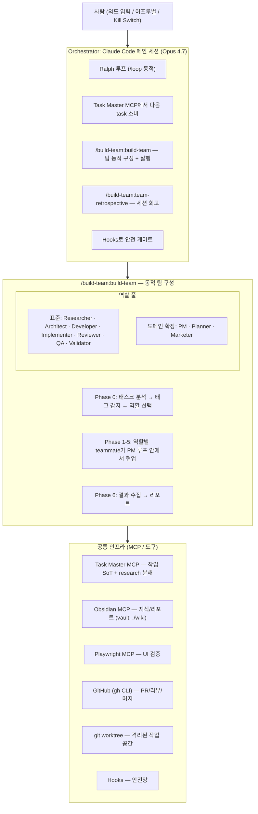
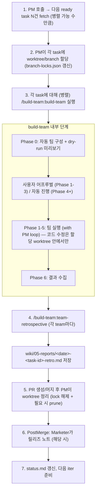
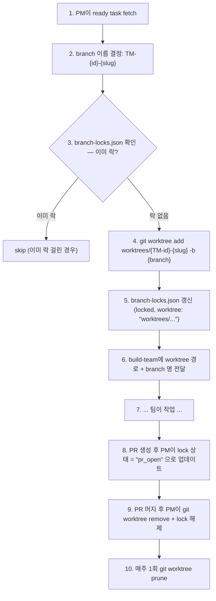
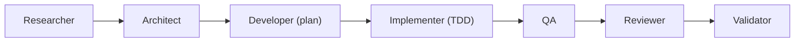
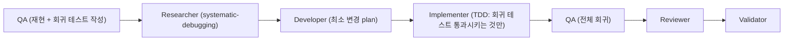
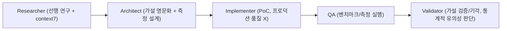
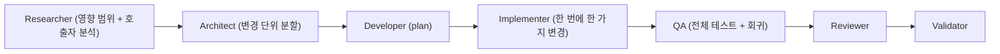
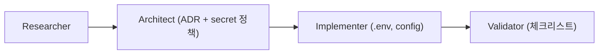
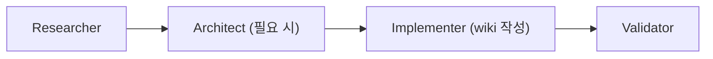
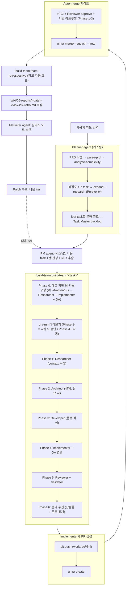

# 에이전트 컴퍼니 설계 — EasyMake 자동화 개발

> **목표**: 사용자가 의도/방향을 입력하면, 멈추라고 하거나 토큰이 소진될 때까지 작업·검증·PR·리뷰·머지가 자율 반복되는 시스템. 매 작업 세션은 회고 리포트를 남겨 다음 세션 효율을 개선한다.

## 1. 핵심 결정 (TL;DR)

- **베이스**: Claude Code 단독 (LangGraph/CrewAI/AutoGen 외부 프레임워크 도입 X)
- **루프**: Ralph 패턴 + `/loop` 동적 모드
- **작업 실행 단위**: `/build-team:build-team` 스킬 (단순 subagent dispatch 대신)
- **회고 자동화**: `/build-team:team-retrospective` 스킬 (매 세션 후 자동 호출)
- **메타 분석**: 주간/월간 워크플로우 리포트 (팀 소통, 병렬 효율, 정확도 분석 + 개선안)
- **작업 SoT**: Task Master MCP (Researcher subagent로 외부 리서치)
- **지식 SoT**: Obsidian (`wiki/`, 사람도 읽는 영구 저장소)
- **리포트 SoT**: `wiki/05-reports/` (세션별 + 주기 메타 분석)
- **wiki 소유권**: **main 브랜치 단독** — feature worktree는 wiki를 읽기만 함, 수정은 main에서만
- **병렬성**: 모든 코드 task는 자체 worktree에서 실행, PM이 worktree/branch 락 테이블 관리
- **점진 자율화**: Phase 0→5 단계별로 신뢰 쌓고 게이트 완화

## 2. 아키텍처



## 3. 작업 실행 = build-team 스킬

### 왜 단순 subagent 대신 build-team인가

- **동적 팀 구성**: 태스크 태그(`#frontend-ui`, `#backend-api`, `#bug-fix` 등) 감지 → 필요한 역할만 선택. 단순 작업은 2명, 복잡 작업은 5명.
- **PM 루프**: Lead가 `TaskList`로 진행상황 모니터링, `[ESCALATE]` / `[ESCALATE-LOOP]` 메시지 라우팅, stall 감지.
- **Skill 라우팅**: 역할별로 적합한 MCP/스킬 자동 매핑 (예: Implementer + figma → `figma:implement-design`).
- **Loop guard**: 무한 피드백 루프 방지 (기본 2회, `team-config`로 조정).
- **재사용 가능한 회고**: `team-retrospective` 스킬이 같은 데이터 모델로 분석.

### Orchestrator의 매 iter 동작



## 3.5 병렬 작업 + Worktree 관리 (PM 책임)

**핵심 제약**: 모든 **코드** 수정 작업은 격리된 worktree에서만 진행. PM이 worktree/branch 락 테이블을 관리하며, 동일 브랜치를 두 worktree가 동시에 점유하지 못하도록 한다.

### Wiki 소유권 규칙 (옵션 2)

`wiki/` 폴더는 **main 브랜치 단독 소유**:

- ✅ wiki/ 물리적 단일 위치: `~/Desktop/remotion-maker/wiki/` (main worktree 루트)
- ✅ Obsidian vault는 항상 이 경로를 봄 → 단일 진실 보장
- ✅ git에 정상 추적됨 (프로젝트 history에 wiki 변경 포함)
- ❌ feature worktree는 wiki를 **수정하지 않음** (읽기만)
  - 이유: worktree는 git이 자동으로 wiki 사본을 만들지만, 수정만 안 하면 충돌 무관
- ✅ wiki 변경이 필요한 작업은 **main worktree에서 직접 실행** (PM/Marketer/메타 분석/문서 task 등)
- ✅ wiki 변경은 별도 commit으로 main에 즉시 적용 (auto-commit by Stop hook)
- 코드 task가 진행 중 wiki 업데이트가 필요하면 → 별도 wiki-only task를 main에서 처리

#### 작업 종류별 실행 위치

| 작업 종류 | 실행 위치 | 예시 |
|---|---|---|
| 코드 변경 (`src/`, `tests/`, etc.) | feature worktree | feature, fix, refactor, experiment |
| **Wiki 변경 (`wiki/**`)** | **main worktree 직접** | status 갱신, PRD, ADR, 회고, mermaid 추가 등 |
| 코드 + wiki 혼합 | feature worktree | 단, wiki는 PR 머지 시까지 보류 — 또는 별도 wiki commit |

### 디렉토리 컨벤션

모든 worktree는 저장소 루트 하위 **`worktrees/`** 디렉토리에 격리:

```
remotion-maker/                            ← 메인 worktree (main 브랜치)
├── src/, wiki/, .claude/, ...
├── .gitignore (worktrees/ 추가됨)
└── worktrees/                             ← (gitignored, 그러나 디렉토리 자체는 사용)
    ├── TM-101-auth-base/                  ← Implementer A 작업
    ├── TM-102-auth-oauth/                 ← Implementer B 작업
    └── setup-agent-company-bootstrap/     ← (예시) 셋업 작업
```

이렇게 두면 `~/Desktop`이 깔끔하고, 단일 프로젝트 폴더 안에서 모든 작업이 자기완결적이다.

### 락 테이블 (`.agent-state/branch-locks.json`)

```json
{
  "TM-101-auth-base": {
    "worktree": "worktrees/TM-101-auth-base",
    "task_id": "TM-101",
    "claimed_by": "team-auth-base",
    "claimed_at": "2026-04-26T10:23:00Z",
    "status": "in_progress"
  }
}
```

`worktree` 값은 **저장소 루트 기준 상대 경로**.

### PM의 워크트리 라이프사이클



### 동시 실행 한도

- 기본 동시 worktree: **3개** (Phase 1-3) → **5개** (Phase 4+)
- 실패 task가 누적되면 한도 자동 감소 (피드백 루프)
- `.agent-state/concurrency-limit` 파일로 동적 조정

### 의존성 처리

- Task Master의 `dependencies` 필드 참조
- 의존 task가 미완료면 PM이 ready 큐에 넣지 않음
- (Phase 5+) Git Town 도입 시 `git town append`로 stack PR 자동 연결

### 충돌 회피

- 같은 파일을 다루는 task는 PM이 직렬화 (락 테이블에 `files_touched` 메타 추가)
- 머지 충돌 시 build-team이 escalate → PM이 우선순위 결정 → 후순위 task rebase

## 3.6 작업 유형 (Task Types)

작업은 단일 유형이 아니라 4가지 카테고리. PM이 task에 유형 태그를 붙이고, build-team의 Phase 0이 이를 보고 팀 구성/SOP를 다르게 라우팅한다.

### 6가지 작업 유형

| 유형 | 태그 | 목적 | 산출물 |
|---|---|---|---|
| **Feature** | `#feature` | 새 기능 추가 | 코드 + 테스트 + PR |
| **Fix** | `#bug-fix` | 버그 수정 | 회귀 테스트 + 패치 + tech-note |
| **Experiment** | `#experiment` | 가설/성능 검증 (기각될 수도) | PoC 코드 + 벤치/리포트 + ADR |
| **Refactor** | `#refactor` | 구조 개선 (행동 변화 X) | 코드 변경 + 동치성 증명 |
| **Infra** | `#infra` | 환경 변수/배포/CI/credential/도메인 | config 파일 + ADR + 운영 문서 |
| **Docs** | `#docs` | 위키/사양/가이드 | wiki 변경 (코드 변경 X) |

### Feature 유형 — 표준 흐름


- 강제 skill: `superpowers:writing-plans`, `executing-plans`, `requesting-code-review`
- TDD 권장이지만 단순 UI는 예외 가능

### Fix 유형 — 디버깅 우선


- 강제 skill: `superpowers:systematic-debugging`, `superpowers:test-driven-development`
- 강제 산출물: **회귀 테스트** (먼저 실패 → 패치 후 통과)
- 추가 강제: `02-dev/tech-notes/<date>-<slug>.md` 작성 (원인 + 교훈)
- 금지: 사양 외 변경, 무관한 리팩터 (분리 PR로)

### Experiment 유형 — 가설 → 구현 → 검증


- 강제 skill: `superpowers:brainstorming`, `context7:query-docs`, 측정/벤치 도구
- 산출물:
  - PoC 코드 (`experiments/<id>/`)
  - 측정 데이터 (`experiments/<id>/data/`)
  - **결과 리포트**: `wiki/05-reports/experiments/<date>-<slug>.md`
  - **ADR**: `wiki/01-pm/decisions/<n>-<slug>.md` (채택 또는 기각 사유)
- 머지 전략:
  - 채택: 결과를 바탕으로 별도 Feature task 생성 → 정식 구현
  - 기각: PoC 브랜치 archive (삭제 X — 향후 재방문 가치)
- 일반 머지 게이트와 다름: **ADR 확정**이 머지 조건
- 비용 가드: experiment 1건당 토큰/시간 상한 (기본 2시간)

### Refactor 유형 — 동치성 우선


- 강제 skill: `superpowers:writing-plans` (작은 단위 분해), `serena:rename_symbol`
- 강제: 동작 변화 0 (기존 테스트 모두 그대로 통과)
- 금지: 동시 기능 추가, 동시 버그 수정 (분리 PR)

### Infra 유형 — 외부 시스템 + 코드 config


- 강제 산출물: ADR (secret 관리 정책), `.env.production.example` 또는 등가, 운영 가이드
- 강제: 실제 credential 값은 commit하지 말 것 (placeholder만)
- 외부 시스템 credential 발급은 사람 어프루벌 — Planner가 blocking_questions로 분리
- 혼합 코드+wiki 시: wiki는 main에 별도 commit (worktree에서는 코드만)

### Docs 유형 — wiki 단독


- main worktree에서 직접 실행 (worktree 생성 X)
- 정보 보존, 산출물 경로 컨벤션 (wiki/CLAUDE.md §8) 준수가 핵심

### 유형 자동 감지 (PM)

PM이 task 본문에서 다음 키워드로 유형 추정 (Planner가 명시 안 한 경우):

| 키워드 | 추정 유형 |
|---|---|
| "버그", "에러", "오류", "fix", "수정", "장애" | `#bug-fix` |
| "검증", "측정", "가설", "벤치", "성능 테스트", "PoC" | `#experiment` |
| "리팩터", "정리", "구조 개선", "이름 변경" | `#refactor` |
| "환경 변수", "credential", "배포", "deployment", "Vercel", "Lambda", "CI/CD", "secret", "도메인" | `#infra` |
| "문서", "위키", "ADR", "가이드", "설명" (코드 변경 없음) | `#docs` |
| 그 외 새 기능 추가 | `#feature` |

혼합 task는 **주된 유형 1개**를 선택, 부 유형은 secondary tag로 표기 (예: 주: `#infra`, 부: `#docs`).

추정이 모호하면 PM이 사용자에게 1번 확인 후 박제.

### 유형별 회고 리포트 가중치

`team-retrospective`가 유형에 따라 다른 측정 지표 강조:

| 유형 | 핵심 지표 |
|---|---|
| Feature | spec 충족도, 테스트 커버리지, 루프 횟수 |
| Fix | 재현 시간, 회귀 테스트 추가 여부, 동일 버그 재발 방지 |
| Experiment | 가설 명문화 품질, 측정 신뢰도, ADR 결정 품질 |
| Refactor | 동치성 (테스트 회귀 0), 분할 단위 적정성 |
| Infra | secret 누출 0, ADR 명확도, 운영 문서 완성도, 롤백 절차 명시 |
| Docs | 정보 정확도, 산출물 경로 컨벤션 준수, mermaid 시각화 적정성 |

## 4. 역할 매핑 (build-team 표준 + 도메인 확장)

build-team의 기본 역할 풀에 우리 워크플로우의 PM/Planner/Marketer를 추가.

| 역할 | build-team 표준? | 책임 | 핵심 스킬/MCP |
|---|---|---|---|
| **Researcher** | ✅ | 코드베이스/외부 컨텍스트 조사 | context7, serena |
| **Architect** | ✅ | 설계, ADR, 트레이드오프 | superpowers:brainstorming |
| **Developer** | ✅ | 구현 플랜 작성 | superpowers:writing-plans |
| **Implementer** | ✅ | 실제 코드 작성 (TDD) | superpowers:executing-plans, serena |
| **Reviewer** | ✅ | 코드 리뷰, spec 대조 | superpowers:requesting-code-review |
| **QA** | ✅ | 테스트, Playwright 검증 | playwright, superpowers:verification-before-completion |
| **Validator** | ✅ | 최종 검증, spec 충족 확인 | superpowers:verification-before-completion |
| **PM** | ➕ 커스텀 | 작업 큐, 우선순위, 리포트 | task-master, obsidian |
| **Planner** (PRD) | ➕ 커스텀 | PRD, task 분해. 리서치 필요 시 Researcher subagent 호출 | task-master (parse-prd, expand), context7 |
| **Marketer** | ➕ 커스텀 | 릴리즈 노트, 카피 | obsidian |

### 권한 격리

- build-team의 표준 역할은 스킬 라우팅을 통해 자연스럽게 권한 분리됨 (Reviewer는 `requesting-code-review`만 사용 → 코드 수정 안 함)
- 커스텀 역할(PM/Planner/Marketer)은 `.claude/agents/<role>.md`로 정의, frontmatter `tools:` 화이트리스트 명시

## 5. End-to-End 파이프라인



## 6. 리서치 워크플로우 (커스텀 Researcher 사용)

> Task Master의 `--research` 옵션 (Perplexity 의존)은 **사용하지 않는다**.
> 대신 build-team의 **Researcher 역할**이 모든 외부 리서치를 담당 (Claude 구독 + context7 + WebSearch).

| 트리거 | 동작 |
|---|---|
| 새 PRD 입력 | Planner가 `parse-prd` → 초기 task tree |
| 모든 신규 task | Planner가 `analyze-complexity` 호출 |
| 복잡도 ≥ 7 또는 도메인 지식 필요 | Planner가 **Researcher subagent 호출** |
| Researcher 결과 | `wiki/03-research/<slug>.md`에 저장 후 Planner가 참조하여 `expand` 수동 분해 |
| build-team 실행 중 추가 리서치 필요 | Researcher 역할이 Phase 1에서 수행 (build-team 내장) |

**Researcher의 핵심 도구**:
- `mcp__plugin_context7_context7__*` — 라이브러리 공식 문서
- `WebSearch`, `WebFetch` — 최신 정보, 블로그, 이슈
- `mcp__plugin_serena_serena__*` — 기존 코드베이스 시맨틱 분석
- 결과물: `wiki/03-research/<slug>.md` 또는 build-team 컨텍스트 파일

## 7. 리포트 시스템

### 3 계층 리포트

| 계층 | 리포트 | 주기 | 작성자 | 용도 |
|---|---|---|---|---|
| **Micro** | Task 회고 | 매 build-team 실행 후 | `team-retrospective` 스킬 | 팀 1회 실행의 효율/품질 |
| **Meso** | 세션 종합 | 사용자 1회 작업 세션 종료 시 | Orchestrator (Stop hook) | 여러 task 묶은 진행 보고 |
| **Macro** | 워크플로우 메타 분석 | **주간 / 월간** | 별도 분석 agent | 컴퍼니 전반의 협업/효율/정확도 |

### 위치 / 명명

```
wiki/05-reports/
├── README.md                            # Reports 인덱스 (자동 갱신)
├── 2026-04-26-task-{id}-retro.md       # Micro: build-team 1회 회고
├── 2026-04-26-session-{n}.md           # Meso: 세션 묶음
├── weekly/2026-W17.md                  # Macro: 주간 메타 분석 (자동, 일요일)
├── monthly/2026-04.md                  # Macro: 월간 메타 분석 (자동, 월말)
└── releases/v0.2.0.md                  # 릴리스 노트 (Marketer)
```

### Macro 리포트 — 워크플로우 메타 분석

매주(일요일 23:59 cron) 또는 월말에 `/build-team:build-team` 호출:
```
역할 풀: Researcher (로그/리포트 수집) + Architect (패턴 분석) + Validator (개선안 검증)
입력:
  - 지난 주/월의 모든 micro retrospective
  - branch-locks.json 이력
  - Task Master 통계 (생성/완료/취소 수, 복잡도 분포)
  - Git 통계 (커밋, PR, 머지, revert, conflict 수)
  - Hooks 로그 (escalate, STOP 트리거, 비용 임계 횟수)
출력: wiki/05-reports/{weekly,monthly}/<period>.md
```

### Macro 리포트 표준 섹션

```markdown
---
title: "Workflow Meta-Analysis 2026-W17"
period: weekly | monthly
tasks_completed: 24
tasks_failed: 3
total_cost_usd: 47.20
---

# 1. 정량 지표
- 완료 task / 실패 task / escalation 횟수
- PR 생성 → 머지 평균 시간
- Reviewer ↔ Implementer 평균 루프 횟수
- Test pass rate (CI), regression 발생 수
- 비용 (총/역할별/모델별)

# 2. 팀 소통 패턴 분석
- Teammate 간 메시지 흐름 (누가 누구에게 얼마나 자주)
- 가장 많이 escalate한 역할 / 가장 많이 받은 역할
- 컨텍스트 공유 효율 (중복 read 패턴, 컨텍스트 파일 활용도)
- 침묵하는 역할 (충분히 일했나, 아니면 작업이 안 흘러갔나)

# 3. 병렬 작업 효율
- 동시 worktree 평균/최대
- 가장 자주 충돌한 파일 / 영역
- 병렬 → 직렬화 전환된 task 수 (PM이 충돌 회피로)
- worktree 평균 수명 (생성 → 머지 → prune)
- 의존성 그래프 깊이 / 병목 task

# 4. 정확도 / 품질
- spec 충족도 평균
- Reviewer가 잡아낸 문제 카테고리 (logic / style / security / perf)
- 머지 후 hotfix 발생 수 (= 통과시킨 후 들킨 버그)
- 테스트 커버리지 변화
- "팬텀 완료" 발생 수 (Task Master는 done인데 산출물 없음)

# 5. 개선 제안 (다음 주기 반영)
- SOP 갱신 후보 (최근 회고에서 반복 등장한 항목)
- 팀 구성 조정 (특정 역할이 비어있거나 과부하)
- 동시성 한도 조정 (성공률 기반)
- 모델 라우팅 조정 (비용 대비 품질)
- Hook/가드 추가 후보

# 6. 리스크 / 적신호
- 같은 실패 패턴 3회 이상 반복 (근본 원인 미해결)
- 비용 추세 우상향
- 사람 escalation 빈도 증가
- 특정 영역 회귀 발생률 증가

# 7. 채택 / 기각 (사람 검토 후 표시)
- [ ] 제안 1: ...
- [ ] 제안 2: ...
```

### 자동 → 수동 → 자동 루프

```
주간 메타 리포트 생성 (자동)
   ↓
사람 검토 (~30분, 매주 1회) → 채택할 개선안 체크박스 표시
   ↓
PM agent가 채택 항목을 SOP/설정에 자동 반영
  - .claude/agents/<role>.md 갱신
  - .agent-state/concurrency-limit 조정
  - prompts/ralph-vN.md 다음 버전 작성
   ↓
다음 주기에 효과 측정 (정량 지표 비교)
```

### 회고 리포트 템플릿 (`team-retrospective` 산출물)

```markdown
---
title: "Task {id} — {요약}"
created: 2026-04-26
tags: [report, retrospective]
task_id: {id}
team_size: 5
duration_minutes: 47
status: completed | escalated | aborted
---

# {제목}

## 1. 작업 결과
- 성공/실패: {bool}
- 산출물: PR #123, 변경 파일 N개, 테스트 +M개
- spec 충족도: {percent}

## 2. Teammate별 작업 로그
| 역할 | 입력 토큰 | 출력 토큰 | 모델 | 주요 산출물 | 소요 |
|---|---|---|---|---|---|
| Researcher | ... | ... | Sonnet | 컨텍스트 요약 | 4분 |
| Implementer | ... | ... | Opus | 구현 + 테스트 | 22분 |
| Reviewer | ... | ... | Sonnet | findings 3건 | 6분 |
| QA | ... | ... | Sonnet | Playwright pass | 8분 |
| Validator | ... | ... | Sonnet | spec 대조 OK | 7분 |

## 3. 피드백 루프 분석
- **에스컬레이션 횟수**: N회
- **루프 반복**: Reviewer ↔ Implementer M회 (loop guard 한도 내)
- **stall 발생**: {여부 / 원인}
- **컨텍스트 낭비**: {중복 read 등 패턴}

## 4. 효율 개선 제안 (다음 세션에 반영)
1. **{관찰}**: Researcher가 같은 파일을 3번 읽음 → 다음엔 결과를 컨텍스트 파일에 저장 후 공유
2. **{관찰}**: Implementer가 Reviewer 피드백 받기 전 commit 4번 → 1차 구현 완료 시 명시적 체크포인트 추가
3. **{관찰}**: QA가 빌드 대기로 6분 idle → 다른 task와 병렬 실행 가능

## 5. SOP 갱신 권장
- `.claude/agents/implementer.md`에 "테스트 통과 후 1회만 commit" 규칙 추가
- `prompts/ralph-v0.md`에 "Researcher 결과를 .agent-state/context-{task}.md로 저장" 규칙 추가

## 6. 다음 iter에 가져갈 결정
- {결정 1, 2, 3 ...}

## 7. 원본 데이터
- TaskList 스냅샷
- 메시지 통계
```

### 인터-세션 피드백 루프

```
세션 N 회고 (5번 항목 "SOP 갱신 권장")
    ↓
사람이 매주 1회 검토 → 채택/기각
    ↓
채택된 항목: .claude/agents/<role>.md / prompts/ralph-vN.md 자동 갱신
    ↓
세션 N+1부터 적용
    ↓
주간 리포트(weekly/)에서 개선 효과 측정 (평균 소요 시간, 루프 횟수, 에스컬레이션 비율)
```

## 8. 안전 게이트 (Hooks)

| Hook | 동작 |
|---|---|
| `SessionStart` | `STOP` 파일 검사 → 있으면 즉시 종료 |
| `PreToolUse(Bash)` | `--no-verify`, `git push --force`, `rm -rf`, main 직접 푸시 차단 |
| `PostToolUse(Edit\|Write)` | prettier/eslint 자동 적용 |
| `PostToolUse(*)` | spend.json 토큰/비용 추적 |
| `Stop` | status.md 갱신, **회고 리포트 자동 트리거** |
| `PreCompact` | 핵심 결정을 Obsidian에 외부화 |

## 9. 폭주 방지 체크리스트

- [ ] `STOP` 파일 존재 → 즉시 종료
- [ ] 일일/주간 토큰 예산 초과 → 정지
- [ ] 무진전 5회 → 정지
- [ ] 같은 파일 10회 이상 수정 → 정지
- [ ] 같은 PR review 3회 실패 → escalate (사람 호출)
- [ ] build-team loop guard 한도 초과 → `[ESCALATE-LOOP]` → 사람 어프루벌
- [ ] 테스트 파일 삭제 시도 → 차단
- [ ] 새 의존성/외부 도메인 → 어프루벌 필요
- [ ] main 직접 푸시 시도 → 차단

## 10. 파일/폴더 구조

```
remotion-maker/
├── .claude/
│   ├── agents/                  # 커스텀 역할만 (build-team 표준은 별도 정의 불필요)
│   │   ├── pm.md
│   │   ├── planner.md
│   │   └── marketer.md
│   ├── hooks/                   # 안전 게이트
│   ├── commands/
│   │   └── ralph.md             # /ralph 진입점
│   └── settings.json            # hooks + 권한
├── .mcp.json                    # task-master, playwright (obsidian 이미 있음)
├── prompts/
│   └── ralph-v0.md              # 매 iter 실행 프롬프트
├── wiki/                        # Obsidian vault
│   ├── 01-pm/
│   ├── 02-dev/
│   │   └── agent-company-blueprint.md  # 본 문서
│   ├── 05-reports/              # ★ 세션 리포트
│   │   ├── README.md
│   │   ├── weekly/
│   │   └── releases/
│   └── 50-marketing/
└── .agent-state/
    ├── STOP
    ├── spend.json
    ├── loop-count
    └── context-{task}.md        # 팀 컨텍스트 파일 (build-team Phase 0)
```

## 11. 도입 로드맵

| Phase | 기간 | 산출물 | 자율성 |
|---|---|---|---|
| **0** | 1시간 | MCP 추가, 폴더 구조, Hooks, STOP 가드, build-team 사전 검증 | 0% |
| **1** | 1일 | 단일 task 실행 (Researcher + Implementer + Validator), 회고 리포트 생성 확인 | 1시간 |
| **2** | 2-3일 | + PM 커스텀 agent, Task Master SoT 정착, 주간 리포트 자동화 | 단일 task |
| **3** | 1주 | + QA + Reviewer (build-team 표준), PR 자동화 닫힘 | PR 1건 (사람 머지) |
| **4** | 2주 | + Planner (research 분해) + Marketer, Phase 0 자동 승인 | 야간 8h |
| **5** | 1개월 | Auto-merge, Agent Teams 검토, 인터-세션 피드백 루프 자동 SOP 갱신 | 멀티 PR |

## 12. 핵심 원칙

1. **사양이 자율성의 상한** — 모호한 spec + 긴 자율 = 폭주
2. **외부 검증 필수** — 테스트/빌드/Playwright가 진실의 원천
3. **권한 격리** — build-team 스킬 라우팅 + 커스텀 agent frontmatter
4. **모델 라우팅** — Opus는 설계/리뷰, Sonnet은 구현/검증, Haiku는 분류
5. **사람은 루프 사이의 게이트** — 루프 안 개입은 비효율
6. **모든 세션은 회고 리포트** — 측정 없이 개선 없음
7. **점진 자율화** — Phase별 신뢰 쌓고 게이트 완화

## 13. 보류된 아이디어

- [[../00-inbox/2026-04-26-git-town-future|Git Town 도입]] — Phase 3 안정화 후 재검토. 스택 PR 자동화 가치.

## 14. 즉시 실행 가능한 다음 단계 (30분)

권한/저장소 문제 해결 후:

1. `git worktree add ../remotion-maker-agentco -b feat/agent-company` 어프루벌
2. `.mcp.json`에 task-master MCP 추가 (Claude Code 구독 사용, 별도 API 키 불필요)
3. `wiki/05-reports/README.md` + `weekly/`, `releases/` 디렉토리 생성
4. `.claude/agents/{pm,planner,marketer}.md` 3개 커스텀 agent 스텁 (build-team 표준 역할은 그대로 사용)
5. `.claude/hooks/` 안전 게이트 + Stop 훅에서 `team-retrospective` 자동 트리거
6. 작은 task 1건으로 `/build-team:build-team` dry-run → 회고 리포트 1개 생성 → 위키에 안착 확인

## 15. 관련 문서

- [[status|개발 현황]]
- [[architecture|시스템 아키텍처]]
- [[../05-reports/README|Reports 인덱스]]
- [[../00-inbox/2026-04-26-git-town-future|Git Town 도입 (보류)]]
- 외부: [Geoffrey Huntley — Ralph 루프](https://ghuntley.com/ralph/)
- 외부: [Task Master AI](https://github.com/eyaltoledano/claude-task-master)
- Skill: `/build-team:build-team` — 동적 팀 구성 + 실행
- Skill: `/build-team:team-retrospective` — 세션 회고
- Skill: `/build-team:team-config` — 팀 구성 커스터마이징
- Skill: `/build-team:team-status` — 진행 상황 조회
- Skill: `/build-team:team-dry-run` — 팀 구성 미리보기
