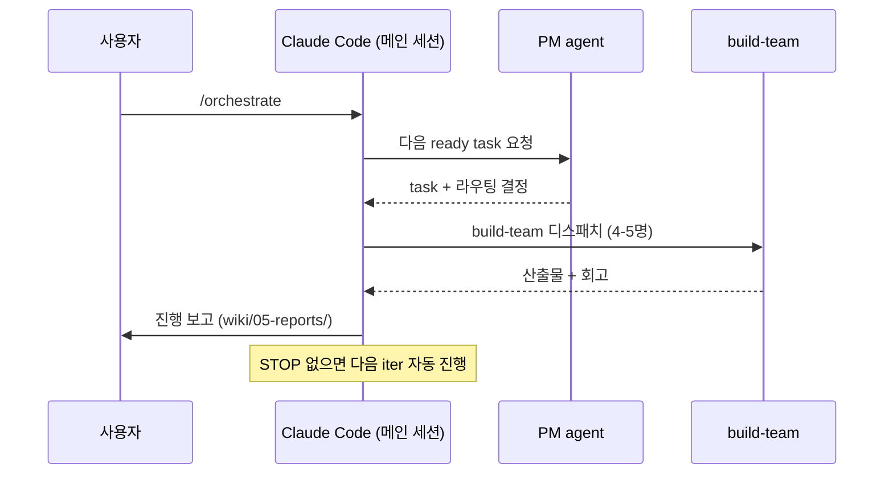
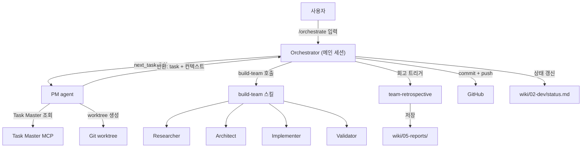

# 🎛️ Orchestrator Runbook

> 에이전트 컴퍼니 자율 실행 운영 절차서. **사용자가 보는 1차 문서**.

## 빠른 시작

### 켜기 (작업 시작)



**한 줄 요약**: Claude Code 세션에서 `/orchestrate` 입력 → 자율 진행 시작.

### 끄기 (작업 정지)

다음 task 시작 전에 안전하게 정지:
```bash
touch .agent-state/STOP
```

긴급 정지 (현재 in-progress 포함 즉시):
```bash
pkill -f claude
```

다시 시작:
```bash
rm .agent-state/STOP
# Claude Code 세션에서 /orchestrate
```

## 모니터링

| 보고 싶은 것 | 어디서 |
|---|---|
| 지금 진행 중인 task | `cat .agent-state/branch-locks.json` |
| 오늘의 진행 요약 | `wiki/02-dev/status.md` |
| 최근 task 회고 | `wiki/05-reports/` 최신 파일 |
| 토큰/비용 추적 | `cat .agent-state/spend.json` |
| 활성 worktree | `git worktree list` |
| GitHub PR 상태 | `gh pr list --state open` |
| 주간 메타 분석 | `wiki/05-reports/weekly/` |

## 안전 게이트

자동 정지 조건 (Orchestrator가 자체 판단):

- `STOP` 파일 존재
- 일일 토큰 예산 95% 초과
- 같은 task 3회 escalate
- 무진전 5회 (git diff 빈 결과)
- 같은 파일 10회 이상 수정
- 새 의존성 추가 / 외부 결제 / production 배포 / DB migration → 사람 호출

자동 차단 (Hooks):
- `--no-verify` 커밋
- `git push --force` to main
- `rm -rf` 실행
- main 브랜치 직접 push (코드 변경 시)

## 운영 시나리오

### 시나리오 1: 야간 자율 실행 (8시간)

```
저녁 11시:
1. git status 확인 (미커밋 변경 X)
2. .agent-state/STOP 없는지 확인
3. .agent-state/spend.json 잔여 예산 확인
4. Claude Code 메인 세션에서 /orchestrate 실행
5. 잠
다음날 아침:
1. wiki/05-reports/ 최신 파일 검토
2. 머지된 PR 검토 (gh pr list --state merged --limit 10)
3. 막힌 task 처리 (status: blocked인 것들 답변)
```

### 시나리오 2: 진행 중 작업 정지

```
1. touch .agent-state/STOP
2. 현재 진행 중인 build-team 마무리될 때까지 대기 (최대 1 iter)
3. Orchestrator가 다음 iter 시작 전 STOP 감지 → 정상 종료
4. 산출물 회고 + commit은 마지막 iter분까지 자동 처리됨
```

### 시나리오 3: 사람 어프루벌 필요 알림 받음

```
Orchestrator가 메시지로 알림:
- "TM-1: production 도메인이 미정입니다. 답변 후 다시 /orchestrate 호출하세요."
조치:
- task의 blocking_questions에 답변 추가 (Task Master 또는 wiki/03-research/)
- 또는 task를 deferred로 marking하고 다른 task부터 진행
```

### 시나리오 4: 회고에서 SOP 갱신 권장 발견

```
1. wiki/05-reports/<date>-<task>-retro.md §5 "SOP 갱신 권장" 검토
2. 채택할 항목 체크
3. /orchestrate에서 별도 Docs task 큐잉:
   "회고 X의 SOP 권장사항 박제"
4. Orchestrator가 처리 → blueprint/agents/prompts 갱신
```

## 첫 실행 체크리스트

다음 사항이 모두 ✅ 되어야 `/orchestrate` 안전 실행 가능:

- [ ] `git status` clean (또는 의도된 변경만)
- [ ] `gh auth status` → greatSweetMango 활성 (이 프로젝트)
- [ ] `direnv` 적용됨 (`echo $GH_USER`이 greatSweetMango)
- [ ] `.mcp.json`에 obsidian + task-master-ai 모두 등록
- [ ] Obsidian 앱 실행 + Claude Code MCP 플러그인 활성화 (포트 22360 listening)
- [ ] `.agent-state/STOP` 부재
- [ ] `.agent-state/branch-locks.json` 적정 상태 (이전 작업 정리됨)
- [ ] `wiki/02-dev/agent-company-blueprint.md` 본 버전 학습됨 (Phase 표시 확인)

## 비상 대응

### A. 무한 루프 의심

```bash
# 1. STOP 파일
touch .agent-state/STOP

# 2. 그래도 안 멈추면
pkill -f claude

# 3. 사후 분석
git log --oneline -20  # 최근 commit 검토
cat wiki/05-reports/<latest>.md  # 최근 retro 검토
```

### B. 머지 충돌

```bash
git worktree list  # 어느 task가 충돌?
# 해당 worktree에서 수동 해결 OR PM에게 task abandon 지시
```

### C. PR 자동 머지가 잘못됨

```bash
gh pr view <num>
gh pr revert <num>  # 또는 직접 revert commit
# 그 후 .agent-state/STOP 으로 정지, 원인 분석
```

### D. .agent-state/ 손상

```bash
# branch-locks.json이 깨졌다면
echo '{}' > .agent-state/branch-locks.json
git worktree list  # 실제 활성 worktree와 sync
```

## 도구별 책임 매트릭스



## 관련

- [[agent-company-blueprint|Blueprint — 전체 설계]]
- [[status|개발 현황 (live)]]
- [[../05-reports/README|Reports 인덱스]]
- `.claude/commands/orchestrate.md` — Orchestrator 슬래시 커맨드 정의
- `.claude/agents/pm.md` — PM SOP
- `prompts/ralph-v1.md` — Ralph 루프 프롬프트
