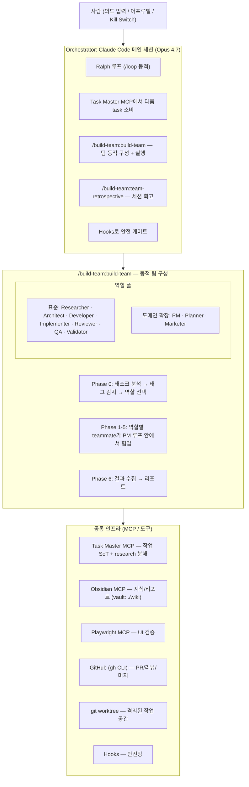

# Blueprint ASCII 인벤토리 + Mermaid 매핑 권장

> **출처**: `wiki/02-dev/agent-company-blueprint.md`
> **목적**: §2, §3.1, §3.5, §3.6(×4), §5 의 ASCII 블록을 mermaid로 무손실 교체하기 위한 사전 인벤토리.
> **본 문서는 RS-1 산출물**이며 AR-1 (Architect 다이어그램 타입 결정) → IM-1 (실제 교체)의 입력이다.

## 0. 공통 mermaid 규칙 (context7 기준)

| 항목 | 규칙 |
|---|---|
| 한글/특수문자 라벨 | **반드시 큰따옴표로 감싸기** — `id["사용자 (의도 입력)"]`. 괄호/슬래시/콜론이 들어간 모든 노드에 적용 |
| Unicode (이모지 포함) | 따옴표 안에서 그대로 사용 가능 (`id["✅ 통과"]`) |
| 큰따옴표 자체 | HTML 엔티티 `#quot;` 사용 |
| 그룹/박스 묶음 | `subgraph NAME ... end` (subgraph 내부 `direction TB/LR` 가능) |
| Obsidian 호환 fence | ` ```mermaid ... ``` ` — Obsidian 기본 렌더 + GitHub 정상 렌더 |
| 권장 타입 | flowchart TD/LR (대부분), stateDiagram-v2 (라이프사이클), sequenceDiagram (참여자 메시지 교환) |

> 주의: ID(좌측)에는 한글/공백 사용하지 말 것. 라벨(따옴표 안)에만 한글. 예: `Person["사람"]` ✓, `사람["사람"]` ✗.

## 1. ASCII 블록 인벤토리

총 **8개 ASCII 블록** (5개 섹션, §3.6은 4 sub-block).

| # | 섹션 | 라인 | 성격 | 권장 타입 |
|---|---|---|---|---|
| B1 | §2 아키텍처 | 29–60 | 4-layer 아키텍처 + 내포 그룹 | `flowchart TD` + 다중 subgraph |
| B2 | §3.1 Orchestrator iter | 74–88 | 7-step 절차 (sub-bullet 포함) | `flowchart TD` + subgraph |
| B3 | §3.5 PM 워크트리 라이프사이클 | 149–160 | 10-step 라이프사이클 (조건 분기 포함) | `flowchart TD` (조건 분기 다이아몬드) |
| B4 | §3.6 Feature 흐름 | 194–196 | 7-노드 선형 파이프라인 | `flowchart LR` |
| B5 | §3.6 Fix 흐름 | 202–205 | 7-노드 선형 (QA 2회 등장) | `flowchart LR` |
| B6 | §3.6 Experiment 흐름 | 213–217 | 5-노드 선형 | `flowchart LR` |
| B7 | §3.6 Refactor 흐름 | 232–235 | 7-노드 선형 | `flowchart LR` |
| B8 | §5 End-to-End | 288–322 | 9-step 종합 (sub-bullet 다수) | `flowchart TD` + subgraph |

---

## 2. 블록별 상세 인벤토리

### B1 — §2 아키텍처 (lines 29–60)

**노드 인벤토리**

| ID 제안 | 라벨 (원문) | 그룹 |
|---|---|---|
| Person | "사람 (의도 입력 / 어프루벌 / Kill Switch)" | (top) |
| Orch | "Orchestrator: Claude Code 메인 세션 (Opus 4.7)" | (Orchestrator subgraph 헤더) |
| OrchB1 | "Ralph 루프 (/loop 동적)" | Orchestrator |
| OrchB2 | "Task Master MCP에서 다음 task 소비" | Orchestrator |
| OrchB3 | "/build-team:build-team 스킬로 팀 동적 구성 + 실행" | Orchestrator |
| OrchB4 | "/build-team:team-retrospective 로 세션 회고" | Orchestrator |
| OrchB5 | "Hooks로 안전 게이트" | Orchestrator |
| BTHeader | "/build-team:build-team — 동적 팀 구성" | build-team subgraph 타이틀 |
| BTPh0 | "Phase 0: 태스크 분석 → 태그 감지 → 역할 선택" | build-team |
| BTPh15 | "Phase 1-5: 역할별 teammate가 PM 루프 안에서 협업" | build-team |
| BTPh6 | "Phase 6: 결과 수집 → 리포트" | build-team |
| BTRolesStd | "표준 역할 풀: Researcher / Architect / Developer / Implementer / Reviewer / QA / Validator" | build-team → Roles 하위 그룹 |
| BTRolesExt | "도메인 확장 (커스텀 agent): PM / Planner / Marketer" | build-team → Roles 하위 그룹 |
| InfraHeader | "공통 인프라 (MCP / 도구)" | Infra subgraph 타이틀 |
| InfraTM | "Task Master MCP — 작업 SoT + research 분해" | Infra |
| InfraOb | "Obsidian MCP — 지식/리포트 (vault: ./wiki)" | Infra |
| InfraPW | "Playwright MCP — UI 검증" | Infra |
| InfraGH | "GitHub (gh CLI) — PR/리뷰/머지" | Infra |
| InfraWT | "git worktree — 격리된 작업 공간" | Infra |
| InfraHK | "Hooks — 안전망" | Infra |

**엣지 인벤토리** (모두 단방향, 라벨 없음)

- Person → Orch
- Orch → BTHeader (group 진입)
- BTHeader → InfraHeader (group 탈출)

> Orchestrator 내부 bullet들은 **엣지가 아니라 그룹 멤버**. subgraph 안에 나열하거나 단일 노드의 `<br/>` 멀티라인으로 표현.

**정보 손실 위험**

- ASCII는 build-team 박스 안에 **표준 역할 풀**과 **도메인 확장**을 시각적으로 묶어 표현. mermaid에서는 build-team subgraph 안에 **중첩 subgraph "Roles"** 사용 권장.
- Orchestrator의 5개 bullet은 노드 1개에 멀티라인 라벨로 압축할 수도, subgraph 멤버로 분리할 수도 있음. AR-1이 결정.
- 4-layer 수직 흐름(사람→Orch→build-team→Infra)은 `flowchart TD`로 자연스럽게 보존됨.

**권장 mermaid 스켈레톤**



---

### B2 — §3.1 Orchestrator의 매 iter 동작 (lines 74–88)

**노드 인벤토리** (7-step + step 3 의 sub-pipeline)

| ID 제안 | 라벨 |
|---|---|
| S1 | "1. PM 호출 → 다음 ready task N건 fetch (병렬 가능 수만큼)" |
| S2 | "2. PM이 각 task에 worktree/branch 할당 (branch-locks.json 갱신)" |
| S3 | "3. 각 task에 대해 (병렬) /build-team:build-team 실행" |
| S3a | "Phase 0: 자동 팀 구성 + dry-run 미리보기" |
| S3b | "사용자 어프루벌 (Phase 1-3) / 자동 진행 (Phase 4+)" |
| S3c | "Phase 1-5: 팀 실행 (with PM loop) — 코드 수정은 할당 worktree 안에서만" |
| S3d | "Phase 6: 결과 수집" |
| S4 | "4. /build-team:team-retrospective (각 team마다)" |
| S4a | "wiki/05-reports/<date>-<task-id>-retro.md 저장" |
| S5 | "5. PR 생성/머지 후 PM이 worktree 정리 (lock 해제 + 필요 시 prune)" |
| S6 | "6. PostMerge: Marketer가 릴리즈 노트 (해당 시)" |
| S7 | "7. status.md 갱신, 다음 iter 준비" |

**엣지 인벤토리**

- S1 → S2 → S3 → S3a → S3b → S3c → S3d → S4 → S4a → S5 → S6 → S7
- 모두 라벨 없는 단방향. S3의 sub-pipeline은 `subgraph BUILD_TEAM` 안에 직렬로 배치.

**정보 손실 위험**

- 원본 ASCII는 step 3 의 `├─` `└─` 트리 구조로 build-team 내부 단계 표현. mermaid에선 **subgraph로 묶고 그 안에서 직렬 흐름**으로 보존.
- step 4 의 "└─" 후속(파일 저장)은 별도 노드 S4a로 직렬화.

**권장 타입**: `flowchart TD` + step 3 subgraph. (sequenceDiagram은 단일 행위자 위주라 부적합.)

---

### B3 — §3.5 PM 워크트리 라이프사이클 (lines 149–160)

**노드 인벤토리** (10 step)

| ID | 라벨 |
|---|---|
| L1 | "1. PM이 ready task fetch" |
| L2 | "2. branch 이름 결정: TM-{id}-{slug}" |
| L3 | "3. branch-locks.json 확인" |
| L4 | "4. git worktree add worktrees/{TM-id}-{slug} -b {branch}" |
| L5 | "5. branch-locks.json 갱신 (locked, worktree: \"worktrees/...\")" |
| L6 | "6. build-team에 worktree 경로 + branch 명 전달" |
| L7 | "7. ... 팀이 작업 ..." |
| L8 | "8. PR 생성 후 PM이 lock 상태 = \"pr_open\" 으로 업데이트" |
| L9 | "9. PR 머지 후 PM이 git worktree remove + lock 해제" |
| L10 | "10. 매주 1회 git worktree prune" |

**엣지 인벤토리**

- L1 → L2 → L3
- L3 → L4 (조건: "락 없음")
- L3 → Skip["skip (이미 락 걸린 경우)"] (조건: "이미 락")
- L4 → L5 → L6 → L7 → L8 → L9 → L10

> 원본 ASCII에는 다이아몬드 명시는 없으나 "이미 락 걸려있으면 skip"이라는 본문 텍스트가 분기를 시사. mermaid 변환 시 **조건 분기를 명시적으로 다이아몬드(`{ }`)로 살리는 것을 권장**.

**정보 손실 위험**

- 단순 1→10 직렬 변환만 하면 step 3 의 skip 분기가 사라짐. AR-1 결정 포인트: (a) 분기 명시 vs (b) 본문 주석 유지.
- 라벨 안 큰따옴표(예: `worktree: "worktrees/..."`)는 `#quot;` 엔티티로 escape.

**권장 타입**: `flowchart TD`. (stateDiagram-v2 도 후보지만 step 라벨이 길어 가독성 떨어짐.)

---

### B4 — §3.6 Feature 흐름 (lines 194–196)

**노드 인벤토리**

`Researcher → Architect → Developer (plan) → Implementer (TDD) → QA → Reviewer → Validator`

| ID | 라벨 |
|---|---|
| F1 | "Researcher" |
| F2 | "Architect" |
| F3 | "Developer (plan)" |
| F4 | "Implementer (TDD)" |
| F5 | "QA" |
| F6 | "Reviewer" |
| F7 | "Validator" |

**엣지**: F1→F2→F3→F4→F5→F6→F7 (라벨 없음)

**위험**: 없음 (단순 선형). **권장**: `flowchart LR`.

---

### B5 — §3.6 Fix 흐름 (lines 202–205)

**노드 인벤토리** — QA 가 시작과 중간에 2번 등장. mermaid에선 **노드 ID 분리** 필요.

`QA (재현+회귀) → Researcher (systematic-debugging) → Developer (최소 변경 plan) → Implementer (TDD: 회귀 테스트 통과) → QA (전체 회귀) → Reviewer → Validator`

| ID | 라벨 |
|---|---|
| X1 | "QA (재현 + 회귀 테스트 작성)" |
| X2 | "Researcher (systematic-debugging)" |
| X3 | "Developer (최소 변경 plan)" |
| X4 | "Implementer (TDD: 회귀 테스트 통과시키는 것만)" |
| X5 | "QA (전체 회귀)" |
| X6 | "Reviewer" |
| X7 | "Validator" |

**엣지**: X1→X2→X3→X4→X5→X6→X7

**위험**: QA를 같은 노드로 합치면 사이클이 만들어져 의미 왜곡 → **반드시 X1, X5 두 노드로 분리**.

**권장**: `flowchart LR`.

---

### B6 — §3.6 Experiment 흐름 (lines 213–217)

`Researcher (선행 연구 + context7) → Architect (가설 명문화 + 측정 설계) → Implementer (PoC, 프로덕션 품질 X) → QA (벤치마크/측정 실행) → Validator (가설 검증/기각, 통계적 유의성 판단)`

| ID | 라벨 |
|---|---|
| E1 | "Researcher (선행 연구 + context7)" |
| E2 | "Architect (가설 명문화 + 측정 설계)" |
| E3 | "Implementer (PoC, 프로덕션 품질 X)" |
| E4 | "QA (벤치마크/측정 실행)" |
| E5 | "Validator (가설 검증/기각, 통계적 유의성 판단)" |

**엣지**: E1→E2→E3→E4→E5

**위험**: 라벨에 `(`, `+`, `,` 다수 — 따옴표 필수.

**권장**: `flowchart LR`.

---

### B7 — §3.6 Refactor 흐름 (lines 232–235)

`Researcher (영향 범위 + 호출자 분석) → Architect (변경 단위 분할) → Developer (plan) → Implementer (한 번에 한 가지 변경) → QA (전체 테스트 + 회귀) → Reviewer → Validator`

| ID | 라벨 |
|---|---|
| R1 | "Researcher (영향 범위 + 호출자 분석)" |
| R2 | "Architect (변경 단위 분할)" |
| R3 | "Developer (plan)" |
| R4 | "Implementer (한 번에 한 가지 변경)" |
| R5 | "QA (전체 테스트 + 회귀)" |
| R6 | "Reviewer" |
| R7 | "Validator" |

**엣지**: R1→R2→R3→R4→R5→R6→R7

**위험**: 없음. **권장**: `flowchart LR`.

---

### B8 — §5 End-to-End 파이프라인 (lines 288–322)

**노드 인벤토리** (메인 9-step + sub-bullet 다수)

| ID | 라벨 | 비고 |
|---|---|---|
| U1 | "사용자 의도 입력" | |
| P1 | "Planner agent (커스텀)" | subgraph 헤더 |
| P1a | "PRD 작성 → parse-prd → analyze-complexity" | Planner 내부 |
| P1b | "복잡도 ≥ 7 task → expand --research (Perplexity)" | Planner 내부 |
| P1c | "leaf task로 분해 완료 → Task Master backlog" | Planner 내부 |
| P2 | "PM agent (커스텀): 다음 task 1건 선정 + 태그 추출" | |
| BT | "/build-team:build-team \"<task>\"" | subgraph 헤더 |
| BT0 | "Phase 0: 태그 기반 팀 자동 구성 (예: #frontend-ui → Researcher + Implementer + QA)" | |
| BTDry | "dry-run 미리보기 (Phase 1-3 사용자 승인, Phase 4+ 자동)" | |
| BT1 | "Phase 1: Researcher (context 수집)" | |
| BT2 | "Phase 2: Architect (설계, 필요 시)" | |
| BT3 | "Phase 3: Developer (플랜 작성)" | |
| BT4 | "Phase 4: Implementer + QA 병렬" | |
| BT5 | "Phase 5: Reviewer + Validator" | |
| BT6 | "Phase 6: 결과 수집 (산출물 + 루프 통계)" | |
| PR1 | "Implementer가 PR 생성" | subgraph 헤더 |
| PR1a | "git push (worktree에서)" | |
| PR1b | "gh pr create" | |
| GATE | "Auto-merge 게이트" | subgraph 헤더 |
| G1 | "✅ CI + Reviewer approve + 사람 어프루벌 (Phase 1-3)" | |
| G2 | "gh pr merge --squash --auto" | |
| RETRO | "/build-team:team-retrospective (회고 자동 호출)" | |
| RETRO1 | "wiki/05-reports/<date>-<task-id>-retro.md 저장" | |
| MK | "Marketer agent: 릴리즈 노트 초안" | |
| LOOP | "Ralph 루프: 다음 iter" | |

**엣지 인벤토리**

- U1 → P1 → P2 → BT → PR1 → GATE → RETRO → MK → LOOP
- Planner 내부: P1 → P1a → P1b → P1c (또는 subgraph 멤버 나열)
- build-team 내부: BT0 → BTDry → BT1 → BT2 → BT3 → BT4 → BT5 → BT6
- PR 내부: PR1a, PR1b (병렬 sub-step)
- 게이트 내부: G1 → G2

**정보 손실 위험**

- 메인 흐름이 길어 단일 `flowchart TD` + 다중 subgraph로 처리해야 가독성 유지.
- "Phase 4: Implementer + QA 병렬" 의 **병렬** 의미를 단일 노드 라벨로만 표현할지, 두 갈래(`BT4a`, `BT4b`)로 분리할지 — AR-1 결정.
- "Phase 1-3 사용자 승인 / Phase 4+ 자동" 의 분기는 단일 노드 라벨로 압축하거나 다이아몬드로 분리 가능.
- LOOP 노드는 다음 iter 시작점인 U1 또는 P2 로 **순환 화살표** 가능 (원본 ASCII는 직선이지만 Ralph 루프 의미상 cycle 표현이 더 정확).

**권장 타입**: `flowchart TD` + 4 subgraph (Planner / build-team / PR / Auto-merge gate).

---

## 3. AR-1 (Architect)에 넘기는 결정 포인트

1. **B1**: Orchestrator의 5개 bullet — 단일 노드 멀티라인 라벨 vs 5개 노드 subgraph 멤버. (가독성 vs 정밀도)
2. **B2**: step 3 의 build-team sub-pipeline — subgraph + 직렬 vs 별도 다이어그램(B1과 중복 우려)
3. **B3**: step 3 의 "이미 락이면 skip" 분기 — 다이아몬드 명시 vs 본문 주석
4. **B5**: QA 두 번 등장 — `X1`/`X5` 분리 (권장) 확정
5. **B8**:
   - Phase 4 의 "Implementer + QA 병렬" — 단일 노드 vs 분기
   - Phase 1-3 어프루벌 vs Phase 4+ 자동 — 다이아몬드 분기 vs 라벨 압축
   - LOOP → 다음 iter 시작점으로 cycle 화살표 추가 여부
6. **fence 통일**: Obsidian/GitHub 모두 ` ```mermaid ` 코드펜스 사용 (이미 wiki/CLAUDE.md §3 와 합치).

## 4. 변환 시 IM-1 체크리스트

- [ ] 한글/특수문자가 들어간 모든 노드 라벨은 큰따옴표로 감싼다.
- [ ] 라벨 안의 큰따옴표는 `#quot;`로 escape.
- [ ] 노드 ID는 ASCII 영숫자만 사용, 한글 ID 금지.
- [ ] 그룹/박스 묶음은 `subgraph NAME ["라벨"] ... end` 로 보존.
- [ ] subgraph 내부 방향이 부모와 달라야 하면 `direction TB|LR|RL|BT` 명시.
- [ ] 변환 후 Obsidian 미리보기와 GitHub 렌더 둘 다 정상인지 VL-1이 확인.
- [ ] 본 task 외 변경 금지: §3.5 "Wiki 소유권 규칙" 표, §1 TL;DR 등 ASCII가 아닌 영역은 손대지 말 것.

## 5. 관련 문서

- [[../02-dev/agent-company-blueprint|Agent Company Blueprint (대상 문서)]]
- [[../CLAUDE|wiki/CLAUDE.md — 시각화 규칙]]
- 컨텍스트: `.agent-state/context-phase1-001-blueprint-mermaid.md`
