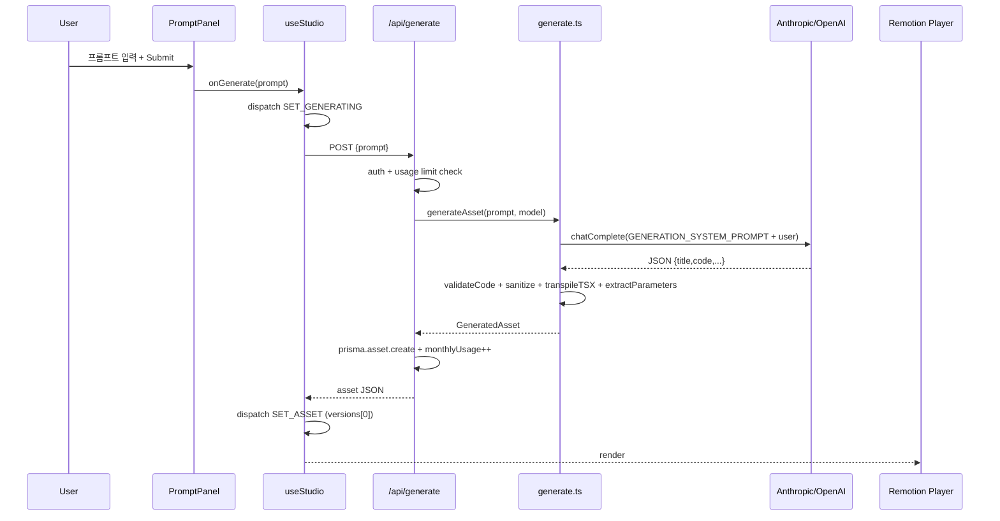

# Clarifying Questions LLM Patterns — TM-11 / GEN-06 Research

**작성**: Researcher (build-tm-11-clarify 팀) / 2026-04-26
**대상 task**: TM-11 GEN-06 — AI 역질문(clarifying questions)
**컨텍스트**: `.agent-state/context-TM-11-clarify.md`
**다음 단계**: Architect (AR-1) — 분기 위치/스키마/휴리스틱 결정

---

## 1. 현재 흐름 매핑



### 핵심 관찰
- `useStudio.generate`는 단일 응답만 처리 (`SET_ASSET`). clarify 분기를 위해 응답 분기형 `mode: 'clarify'|'asset'` 처리 필요.
- `generate.ts`는 단일 LLM 호출. clarify 분기를 prepend/통합 가능.
- `PromptPanel`은 이미 `isLoading`/`mode` state 보유 — clarify 카드 추가 자연스러움.
- `/api/generate`는 generate 성공 시 `monthlyUsage++`. clarify-only 응답에서는 카운트 미증가 정책 권장.

---

## 2. 분기 위치 후보

| 옵션 | 위치 | 장점 | 단점 |
|---|---|---|---|
| **A. 서버 통합 (권장)** | `generate.ts`에서 단일 LLM에게 clarify+generate 통합 위임. 모델이 `{mode:"clarify", questions:[...]}` 또는 `{mode:"asset", title,code,...}` 중 하나 반환 | 단일 라운드트립, 클라이언트 단순, 휴리스틱 불필요(LLM 자체 판단), 캐싱 친화 | 시스템 프롬프트 길이 증가 |
| **B. 서버 2단계** | (1) Haiku classify 호출 → (2) clarify 또는 generate. `/api/generate` 응답 분기 | 분류기 비용 저렴, 명확 케이스도 빠름 | 호출 2회, 라운드트립 ↑, 라우트 분기 복잡 |
| **C. 클라이언트 휴리스틱** | `PromptPanel`/`useStudio`에서 길이/키워드로 모호성 판정 → `/api/clarify` 또는 `/api/generate` | 0원 분기, UX 즉시성 | 휴리스틱 정확도 낮음, 다국어 어려움, 유지보수 부담 |

**추천: A (서버 통합)** — 단일 호출이라 추가 비용 거의 0, 다국어/뉘앙스 robust, 기존 LLM 호출에 분기 응답만 추가하면 끝.

---

## 3. 모호성 휴리스틱 후보

| 휴리스틱 | 위치 | 장점 | 단점 |
|---|---|---|---|
| **H1. 길이/단어수** (< 5 words OR < 25 chars) | client+server | 빠름, 명확 신호 | 짧고 명확("red counter 0-100 3s") 오탐 |
| **H2. 키워드 블랙리스트** (`아무거나`, `만들어줘`, `something`, `cool`, `nice`) | client+server | high precision | recall 낮음 |
| **H3. LLM self-judgment** (시스템 프롬프트에 "정보 부족 시 mode:clarify 반환") | server | 다국어 robust, 정확, 추가 호출 0 | 시스템 프롬프트 토큰 ↑ |

**추천 조합: H3 메인 + H1 보조 hint**. 클라이언트에서 명백히 상세한 프롬프트(>15 words AND 숫자/색상 토큰 포함)는 `skipClarify=true` 힌트를 보내 시스템 프롬프트에서 분기 비활성화 → 토큰 절감.

---

## 4. JSON 스키마 제안

```ts
// src/types/index.ts에 추가
export type ClarifyMode = 'clarify' | 'asset';

export interface ClarifyChoice {
  id: string;             // "bar" | "line" | "auto"
  label: string;          // "막대 차트"
}

export interface ClarifyQuestion {
  id: string;             // "chartType"
  question: string;       // "어떤 차트를 원하시나요?"
  choices: ClarifyChoice[]; // 2-4개
  allowSkip?: boolean;    // default true
}

export interface ClarifyResponse {
  mode: 'clarify';
  questions: ClarifyQuestion[]; // 1-3개
  originalPrompt: string;
}

export interface AssetResponse extends GeneratedAsset {
  mode: 'asset';
}

export type GenerateApiResponse = ClarifyResponse | AssetResponse;
```

**답변 합치기 패턴**: 사용자가 선택한 답을 다음과 같이 prompt에 append 후 재호출 (with `skipClarify: true`):

```
{originalPrompt}

[사용자 명세]
- chartType: 막대 차트
- dataType: 매출
- duration: 3초
```

---

## 5. CLARIFY_SYSTEM_PROMPT 초안

```
You are an animation request analyzer. Given a user prompt, decide one of two paths:

(1) ENOUGH DETAIL → output the animation as JSON in the GENERATION format with field "mode":"asset".

(2) TOO VAGUE (missing visual subject, missing data, missing style) → output:
    {
      "mode": "clarify",
      "questions": [
        {
          "id": "chartType",
          "question": "어떤 차트를 원하시나요?",
          "choices": [
            { "id": "bar",  "label": "막대 차트" },
            { "id": "line", "label": "선 그래프" },
            { "id": "pie",  "label": "원 그래프" }
          ],
          "allowSkip": true
        }
      ]
    }

Rules:
- 1-3 questions max
- Multiple-choice with 2-4 short labels
- Cover the most impactful unknowns only (subject, data, style, duration)
- Detect user language and respond in same language

Return ONLY valid JSON. No markdown fences.
```

옵션 A 채택 시: GENERATION_SYSTEM_PROMPT에 위 분기 규칙을 통합. 옵션 B 채택 시: 별도 `CLARIFY_SYSTEM_PROMPT` export.

---

## 6. 비용·성능 추정 (Anthropic Haiku 4.5 기준: input $0.80/MTok, output $4/MTok)

| 시나리오 | input tok | output tok | 비용 |
|---|---|---|---|
| 명확 프롬프트 (mode:asset) | ~700+30 | ~1200 | ~$0.0058 (변화 없음) |
| 모호 프롬프트 (mode:clarify) | ~750+10 | ~150 | ~$0.0012 |
| 답변 후 재생성 | ~750+80 | ~1200 | ~$0.0055 |
| **모호→clarify→generate 합** | | | **~$0.0067** (vs 명확 $0.0058, +$0.0009) |

옵션 B (분류기 분리): 분류 ~$0.0005 + generate $0.0058 = ~$0.0063. 명확 케이스에도 분류 비용 추가.
→ **옵션 A가 명확 케이스에서 추가 비용 0이라 우월.**

지연: Haiku 평균 first-token ~600ms, 완료 ~1.5–2.5s. 사용자 체감 영향 미미.

---

## 7. 분기 응답 처리 — 클라이언트 변경 포인트

- **`useStudio`**: `clarifyState: { questions, originalPrompt, answers } | null` 추가, action `SET_CLARIFY` / `SET_CLARIFY_ANSWER` / `CLEAR_CLARIFY`. `generate` 함수에서 응답 `mode` 분기.
- **`PromptPanel`**: `clarifyState` prop 받아 카드 렌더 (질문 + 라디오/버튼 + Skip + Continue 버튼). 답변 모이면 `onClarifyResolve(answers)` → `useStudio.generate(originalPrompt, answers, skipClarify=true)`.
- **`/api/generate` route**: `generateAsset` 결과가 `{mode:'clarify'}`이면 `prisma.asset.create` 건너뛰고 usage 카운트도 미증가 — 응답만 passthrough.
- **`generate.ts`**: 시그니처 변경 `Promise<GeneratedAsset | ClarifyResponse>`. JSON 파싱 후 `mode` 분기. `validateCode`/`transpile`/`extractParameters`는 `mode==='asset'`에서만 실행.

---

## 8. 위험·고려사항

- **JSON 파싱 견고성**: 현재 `text.match(/\{[\s\S]*\}/)`는 fragile (greedy regex). clarify 응답은 짧아 안전하지만, code response가 nested object 포함하면 깨질 수 있음. 현재 작동 중이므로 그대로 두되, Architect가 `jsonrepair` 도입 여부 결정.
- **사용량 카운팅**: clarify 응답은 `monthlyUsage++` 미발생. clarify→generate flow는 1회로 카운트(재호출 시 `skipClarify=true`로 generate path만 실행).
- **PRO 티어**: 현재 Sonnet 사용. clarify 단계만 Haiku로 강제하는 옵션도 있음(비용 절감). Architect 결정.
- **i18n**: 시스템 프롬프트에 `Detect user language and respond in same language` 명시 필수.
- **Sandbox 영향 없음**: clarify 응답에 code field 없음 → `validateCode` 미호출. PARAMS 추출 영향 0 (검증 기준 7 만족).

---

## 9. Architect (AR-1)에 위임할 결정 사항

1. **옵션 A vs B** 결정 — A 권장
2. `CLARIFY_SYSTEM_PROMPT` 별도 export vs `GENERATION_SYSTEM_PROMPT` 통합
3. `skipClarify` 클라이언트 휴리스틱 채택 여부
4. `ClarifyResponse` shape 동결 (위 §4 초안 검토)
5. usage 카운팅 정책 박제 (ADR-0005 후보)
6. PRO 티어 clarify 단계 모델 선택 (Haiku 강제 vs Sonnet 유지)

---

## 10. 핵심 파일 위치 (Implementer 참조)

| 파일 | 변경 사항 |
|---|---|
| `src/types/index.ts` | `ClarifyChoice`, `ClarifyQuestion`, `ClarifyResponse`, `GenerateApiResponse` 추가, `StudioAction`/`StudioState`에 clarify 필드 추가 |
| `src/lib/ai/prompts.ts` | (옵션 A) `GENERATION_SYSTEM_PROMPT`에 분기 규칙 추가 / (옵션 B) `CLARIFY_SYSTEM_PROMPT` 별도 export |
| `src/lib/ai/generate.ts` | 반환 타입 union 변경, mode 분기, validateCode 등 mode==='asset'에서만 |
| `src/app/api/generate/route.ts` | mode==='clarify'면 DB 저장/usage 증가 skip |
| `src/hooks/useStudio.ts` | clarify 상태/액션, `resolveClarify(answers)` 함수 |
| `src/components/studio/PromptPanel.tsx` | clarify 카드 UI (질문 카드 + 라디오/버튼 + Skip/Continue) |
