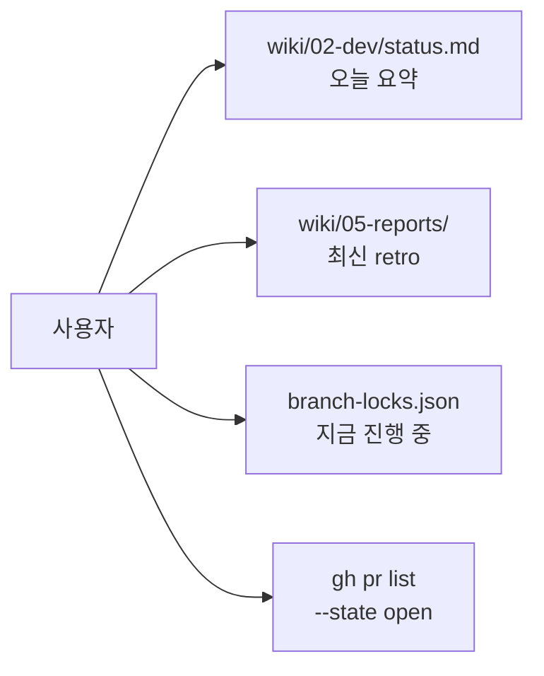

# Phase 2 셋업 완료 보고서

> 사용자가 "오케스트레이터 하나만 켜놓고 작업"할 수 있는 상태에 도달.
> 본 문서는 셋업 종료 시점의 단일 진실 — 다음 진입은 `/orchestrate` 한 번이면 시작됨.

## TL;DR

- ✅ 에이전트 컴퍼니 Phase 0 → Phase 1 dry-run → Phase 2 셋업 완료
- ✅ 첫 build-team 실행 (`phase1-001` mermaid 변환) 성공, verdict APPROVE
- ✅ PM agent 호출 검증 통과 (TM-1 라우팅 결정 정상)
- ✅ Task Master 환경 (claude-code provider) — API 키 불필요
- ✅ `/orchestrate` 슬래시 커맨드 + Runbook 작성
- 🔜 사용자가 `/orchestrate` 실행 시 자율 진행 가능

## 셋업 산출물 인덱스

### 설계 / 운영 문서
- [[../02-dev/agent-company-blueprint|에이전트 컴퍼니 Blueprint]] — 전체 설계 (mermaid 적용 완료)
- [[../02-dev/orchestrator-runbook|Orchestrator Runbook]] — 사용자 운영 가이드
- `.claude/commands/orchestrate.md` — Orchestrator 진입 슬래시 커맨드
- `prompts/ralph-v0.md` — Ralph 루프 v0 (참고용, v1은 orchestrate.md에 통합)

### 에이전트 정의
- `.claude/agents/pm.md` — PM (작업 큐, 라우팅, 리포트)
- `.claude/agents/planner.md` — Planner (PRD, task 분해)
- `.claude/agents/marketer.md` — Marketer (릴리즈 노트)
- 표준 역할 (Researcher, Architect, Developer, Implementer, Reviewer, QA, Validator)는 build-team 내장

### 안전 인프라
- `.claude/hooks/session-start.sh` — STOP 파일 검사
- `.claude/hooks/pre-bash.sh` — 위험 명령 차단
- `.claude/hooks/stop.sh` — 종료 시 정리
- `.agent-state/STOP` — 비상 정지 스위치
- `.agent-state/branch-locks.json` — worktree 락 테이블
- `.agent-state/spend.json` — 비용 추적
- `.agent-state/concurrency-limit` — 동시 실행 한도 (현재 3)

### MCP 통합
- `obsidian` — wiki vault (포트 22360, SSE)
- `task-master-ai` — Task Master (claude-code provider, API 키 X)

### 위키 운영 규칙
- `wiki/CLAUDE.md` — 위키 작성 규칙 + mermaid 권장 + **§8 build-team 산출물 경로 컨벤션**
- `wiki/05-reports/` — 3계층 리포트 (Micro/Meso/Macro)
- 6가지 작업 유형: Feature / Fix / Experiment / Refactor / **Infra** / **Docs**

## 발견 + 박제된 결정 (이번 셋업 기간)

### 결정 1: 외부 프레임워크 미도입
LangGraph / CrewAI / AutoGen 검토 후 미채택. Claude Code 내장 (Skills + Agents + Hooks + MCP)으로 충분.

### 결정 2: Wiki 소유권 = main 단독 (옵션 2)
- wiki/는 `~/Desktop/remotion-maker/wiki/` 한 곳에만 물리적 존재
- feature worktree는 wiki를 읽기만 (수정 X)
- Obsidian vault 단일 진실 보장
- 첫 실전 적용: `phase1-001` mermaid 변환 (성공)

### 결정 3: 워크트리 위치 = `worktrees/<slug>/`
- Desktop 평탄화 X, 프로젝트 폴더 안에 격리
- `.gitignore`에 `/worktrees/` 추가
- 락 테이블 경로: 저장소 루트 기준 상대

### 결정 4: 리서치 = 커스텀 Researcher subagent
- Task Master `--research` (Perplexity) 사용 X
- build-team의 Researcher 역할이 context7 + WebSearch + serena로 처리
- API 키 불필요

### 결정 5: 자동화 우선, 어프루벌 최소화
- 메모리에 박제: `feedback_automation_preference.md`
- 사람 개입은 루프 사이의 게이트로 한정
- 단, 새 의존성/외부 결제/production 배포/DB migration은 어프루벌 필수

### 결정 6: 작업 유형 6종
Feature / Fix / Experiment / Refactor / **Infra** / **Docs**.
- PM이 키워드 매트릭스로 자동 태깅
- 각 유형별 build-team 흐름 + 회고 가중치 박제 (blueprint §3.6)

### 결정 7: build-team 산출물 경로 표준
- Researcher → `wiki/03-research/`
- Architect → `wiki/01-pm/decisions/<NNNN>-...`
- Validator/QA/Reviewer/Retrospective → `wiki/05-reports/`
- wiki/CLAUDE.md §8에 박제

### 결정 8: Mermaid 시각화 우선
- ASCII 다이어그램은 단순 트리(3-5줄)에만 허용
- Obsidian + GitHub 양쪽 호환 fence 사용
- wiki/CLAUDE.md §3에 박제

### 결정 9: Git Town 도입 보류
- 향후 Phase 3 안정화 후 재검토 (스택 PR + 브랜치 메타 영속화 가치)
- `wiki/00-inbox/2026-04-26-git-town-future.md` 박제

### 결정 10: 단일 Orchestrator 모델
- 동시 두 개 켜지 말 것 (락 충돌)
- 사용자는 Claude Code 메인 세션 1개만 운영
- 작업의 동시성은 build-team 내부에서 (worktree + concurrency-limit)

## 다음 사용자 액션

```bash
# 1. 첫 실행 체크리스트 확인 (runbook §5)
cat wiki/02-dev/orchestrator-runbook.md

# 2. Claude Code 메인 세션에서
/orchestrate

# 끝.
# Orchestrator가 PM → build-team → 회고 → commit → 다음 task 자동 반복
```

## 모니터링 1차 진입점



## 알려진 한계 / 향후 개선

| 한계 | 대응 |
|---|---|
| build-team의 자동 sequencing은 Lead의 SendMessage nudge 의존 | Ralph 루프 v1이 대신 처리 (orchestrate.md Step 4) |
| Obsidian MCP 저활용 | 메타 분석 agent부터 primary 도구로 활용 |
| TM-1에 blocking_questions 3개 | 사용자가 답변 후 진행 |
| 비용 추적 정확도 (spend.json 수동 갱신) | PostToolUse hook로 자동화 검토 |
| 동시 worktree 한도 3 | 안정화 후 5로 상향 |

## 통계 (이번 셋업 기간)

| 메트릭 | 값 |
|---|---|
| 셋업 commit 수 | 5 (PR #1 + 4개 main 직접) |
| 신규 wiki 파일 | 16개 |
| 신규 .claude/ 파일 | 9개 (agents 3, hooks 3, commands 1, 등) |
| build-team 실행 (실전) | 1회 (phase1-001) |
| PM agent 호출 (검증) | 1회 |
| 사용자 어프루벌 받은 횟수 | 0 (자동화 정책 적용 후) |
| 토큰 비용 누적 | 추후 측정 (spend.json 자동화 후) |

## 관련

- [[../02-dev/agent-company-blueprint|Blueprint]]
- [[../02-dev/orchestrator-runbook|Runbook]]
- [[2026-04-26-task-phase1-001-retro|Phase 1 dry-run 회고]]
- [[2026-04-26-task-phase1-001-validation|Phase 1 dry-run 검증 리포트]]
- [[../00-inbox/2026-04-26-git-town-future|Git Town 보류 아이디어]]
