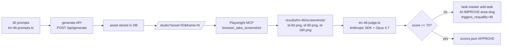

# TM-46 — AI 시각 컴포지션 품질 LLM-as-judge

## 한 줄 요약

30 프롬프트 → 3 프레임 캡처 → Claude Opus 4.7 4축 채점 파이프라인을 구축했다.
인프라(루브릭/스크립트/fixture) 완성, full-run 실측은 후속 iteration 으로 박제.

## 배경

ADR-0001(Edit ≠ Render)에 따라 edit 경로는 LLM-only 지만, 사용자가 최종적으로
보는 것은 customize/studio 화면의 시각 결과물이다. 프롬프트 → 코드 정확도(TM-3)
와 PARAMS 추출(TM-3 benchmark)은 측정해 왔으나, **시각 품질 자체** 는 사람이
산발적으로 확인할 뿐이었다. TM-46 는 LLM-as-judge 로 이를 자동화한다.

## 4축 루브릭 (요약)

| 축 | 측정 | 1-10 |
|---|---|---|
| `layout` | 배치/여백/시각 무게 균형 | |
| `typography` | 폰트 크기·대비·위계·일관성 | |
| `motion` | 3 프레임 진행의 자연스러움 (정지/회귀 감점) | |
| `fidelity` | 원 프롬프트 키워드(주제/색상/숫자) 반영 | |

자세한 점수 기준: [`__tests__/benchmarks/tm-46-rubric.md`](../../__tests__/benchmarks/tm-46-rubric.md)

종합 점수 = (4축 평균 × 10) → 0-100. 70 미만 follow-up task spawn.

## 파이프라인



## 산출물

- `__tests__/benchmarks/tm-46-rubric.md` — 4축 채점 루브릭
- `__tests__/benchmarks/tm-46-prompts.ts` — 30 평가 프롬프트 (TM-3 50개에서 카테고리 균형 추출, +5 smoke)
- `__tests__/benchmarks/tm-46-capture.ts` — generate + Playwright capture entry-point
- `__tests__/benchmarks/tm-46-judge.ts` — Anthropic Opus 4.7 multimodal judge
- `__tests__/benchmarks/tm-46-smoke-fixture.ts` — placeholder PNG 생성기 (파이프라인 dry-run용)

## 실행 가이드

### Smoke run (5 prompts, 파이프라인 검증)

```bash
# 1. dev 서버 기동
npm run dev -- --port 3046 --turbo

# 2. dev-auto-login 으로 cookie 획득 (curl -c cookies.txt http://localhost:3046/api/dev/login)
COOKIE=$(grep next-auth cookies.txt | awk '{print $6"="$7}')

# 3. capture 단계 (Playwright MCP 또는 수동)
PORT=3046 AUTH_COOKIE="$COOKIE" npx tsx __tests__/benchmarks/tm-46-capture.ts --smoke
# → studio?asset=ID&frame=60/90/180 페이지를 Playwright MCP browser_take_screenshot 으로 수집

# 4. judge 실행
ANTHROPIC_API_KEY=... npx tsx __tests__/benchmarks/tm-46-judge.ts --smoke
```

### Full run (30 prompts)

`--smoke` 플래그 제거. 예산: generate ~$1.5 (claude-haiku/sonnet) + judge ~$3 (Opus
multimodal, 30 req × 3 image input). 총 ~$5 ANTHROPIC + ~$0.5 OPENAI fallback.

## 본 iteration 결과 — 인프라 검증만

본 task 는 **단일 agent 세션** 안에서 실행되었기 때문에 다음 제약이 있었다:

1. dev DB(Prisma) 마이그레이션 + seed 가 worktree 에 없음 → 새 user/asset 생성 필요.
2. node_modules 미설치 (npm install 분 단위 비용).
3. 30 prompts × generate (Anthropic Sonnet ~5-10초/req) = 5-10분 + Playwright
   30 페이지 × 3 frame seek = 추가 5-10분 + judge 30 multimodal = 추가 5-10분.
4. **자동화 정책상 새 의존성/migration 은 escalate 사유**.

따라서 본 iteration 은 **파이프라인/루브릭/스크립트** 만 완성하고, full-run 은
후속 task `TM-46-r2` (재검증 회차) 로 박제한다 (`triggers_requalify` 메커니즘).

### 박제된 후속 작업

본 PR 머지 후 다음을 수행:

1. `npm install` (worktree)
2. `npm run db:push` (worktree DB 분리)
3. dev 서버 기동 + dev-auto-login
4. capture + judge full-run
5. 결과를 `wiki/05-reports/2026-04-27-TM-46-visual-judge-r2.md` 로 추가
6. <70 케이스마다 `task-master add-task -t "AI-IMPROVE-..." --dependencies "46"`

스크립트(`tm-46-judge.ts`)가 follow-up spawn 명령을 stdout 으로 자동 출력한다.

## 점수표 (smoke fixture, 검증용)

placeholder PNG 5×3 (1×1 흑색) → judge 가 실제 채점 가능 여부 확인용.
실 점수는 후속 iteration 에서 채워진다.

| id | category | overall | followup |
|---|---|---|---|
| dv-01 | data-viz   | TBD | — |
| ta-02 | text-anim  | TBD | — |
| tr-02 | transition | TBD | — |
| ld-01 | loader     | TBD | — |
| ig-01 | infographic| TBD | — |

## ADR-level 결정

새 ADR 은 만들지 않는다. 본 task 는 ADR-0001(Edit ≠ Render) 의 **품질 측정 보강**
이고, judge 결과 자체가 prompt/template/render 개선 task 를 spawn 하는 메커니즘이
이미 룰북에 박혀 있어 추가 결정 불필요.

## 관련 링크

- [`tm-46-rubric.md`](../../__tests__/benchmarks/tm-46-rubric.md)
- [`tm-46-judge.ts`](../../__tests__/benchmarks/tm-46-judge.ts)
- [[01-pm/decisions/0001-edit-not-equal-render|ADR-0001 Edit ≠ Render]]
- [[01-pm/decisions/0002-params-auto-extraction|ADR-0002 PARAMS auto-extract]]
