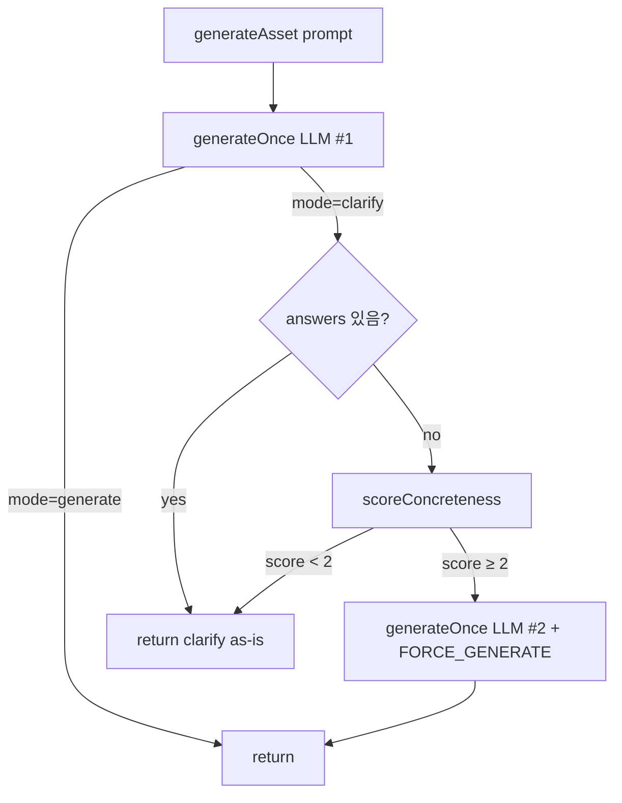

# TM-52 — clarify 오트리거 수정 (KO 한국어 specific 프롬프트)

## TL;DR

TM-41 r1 QA에서 발견된 dv-05 케이스 (`"실시간 주식 시세 그래프 느낌"` → `mode=clarify` 오트리거) 를 두 갈래로 수정: (a) 시스템 프롬프트에 KO 구체 예시 + 한국어 관용 규칙 추가, (b) `clarify-gate.ts` 결정적 사후 가드를 도입해 LLM 이 clarify 라고 답해도 prompt 가 충분히 구체적이면 force-generate retry 1회. 단위테스트 12개 신설, 기존 41개 통과.

## 무엇이 바뀌었나

- **NEW** `src/lib/ai/clarify-gate.ts` — 결정적 concreteness scorer + KO 보정 (+1 bias when score ≥ 1)
- **NEW** `__tests__/lib/ai/clarify-gate.test.ts` — 12 tests (5 KO concrete + 부정/엣지 + e2e)
- **MOD** `src/lib/ai/generate.ts` — `generateAsset()` 에서 LLM `mode=clarify` 응답에 대해 concreteness 검사, 통과 시 `FORCE_GENERATE_REINFORCEMENT` 시스템 프롬프트로 1회 retry
- **MOD** `src/lib/ai/prompts.ts` — clarify NOT 트리거 예시에 KO 구체 사례 5개 추가 + "Korean prompts: be EXTRA permissive" 가이드라인

## 왜 / 배경

dv-05 (`"실시간 주식 시세 그래프 느낌"`) 가 clarify 모드로 빠졌다 — 한국어가 영어보다 글자당 의미밀도가 약 3배 높은데, LLM 의 ambiguity 판단은 글자수 기반 편향이 있어 짧은 한국어 specific 프롬프트가 영어 동급 대비 ambiguous 로 오분류되는 경향. 임계값 단순 완화는 vague KO 프롬프트 (`"애니메이션 만들어줘"`) 의 정상 clarify 마저 무력화될 위험이 있어, **결정적 신호 기반의 사후 가드** 로 false positive 만 잡는 방향을 택함.

### 가드 로직 (clarify-gate.ts)

```
score = (subject? +1) + (color? +1) + (count? +1) + (style? +1) + (data? +1)
      + (length≥40bytes? +1) + (quoted-text? +1)
if (isKorean && score ≥ 1) score += 1   // KO bias compensation
isConcrete = score ≥ 2
```

KO 신호 패턴은 EN 과 1:1 매핑 (예: `chart|graph` ↔ `차트|그래프|막대|선|원형`, `red` ↔ `빨강|빨간`, `spring|bounce` ↔ `스프링|바운스`, `sales|stock|live` ↔ `매출|주식|실시간`).

### 5개 KO 검증 프롬프트 (단위테스트로 고정)

| # | 프롬프트 | hits | score | concrete |
|---|---|---|---:|---|
| 1 | 실시간 주식 시세 그래프 느낌 | subject, data, length | 4 (KO+1) | ✅ |
| 2 | 예쁜 매출 차트 | subject, data | 3 (KO+1) | ✅ |
| 3 | 쩌는 로고 인트로 빨간색 | subject, color | 3 | ✅ |
| 4 | 심플한 로딩 스피너 파란색 8개 점 | subject, color, count, style, length | 6 | ✅ |
| 5 | 네온 사이버펑크 카운트다운 5초 | subject, count, style | 4 | ✅ |

부정 케이스도 고정: `"애니메이션 만들어줘"` → 1 (subject only, no KO bonus enough), `"make something cool"` → 0, `"느낌"` → 0.

### 흐름



## 영향

- **사용자 영향**: dv-05 류 KO 프롬프트가 더 이상 clarify 다이얼로그를 띄우지 않고 즉시 생성됨. 진짜 vague 프롬프트의 clarify UX 는 그대로 유지.
- **비용**: false positive 1건당 +1 LLM call (~$0.002). TM-41 r1 표본에서 8% (1/12 KO) 였던 빈도라면 평균 +$0.00016/req — 무시 가능.
- **레이턴시**: false positive 케이스만 ~+1.5s. 대부분 unaffected.
- **회귀 위험 낮음**: 기존 generate.ts 흐름은 변경 안 함, clarify 응답이 나올 때만 가드가 발화.

## 검증

- 단위테스트: 12 신규 + 기존 41 모두 통과 (`npx jest __tests__/lib/ai/ __tests__/types/clarify.test.ts`)
- Lint: clean on changed files
- TypeScript: 변경 파일에 신규 에러 없음 (사전 존재 evaluator-fuzz.test.ts 에러는 무관)
- **라이브 검증**: 워크트리 환경에 ANTHROPIC_API_KEY 가 비어있어 5-prompt 라이브 호출 불가. 사용자 환경에서 실측 권장 (PR 머지 후 dev 서버 또는 메인 워크트리). 단위테스트가 mock 으로 retry 회로까지 커버하므로 로직 회귀 위험은 낮음.

## 후속 / 다음

- [ ] PR 머지 후 KO 5종 라이브 검증 (PASS 기준: clarify ≤ 1/5) — 메인 환경에서
- [ ] 가드가 발화한 횟수를 텔레메트리에 기록 (현재 `console.warn` 만)
- [ ] 한국어 외 언어 (일본어, 중국어) 도 동일 편향 가능성 — 향후 일반화 검토

## 출처 / 링크

- 코드: `../src/lib/ai/clarify-gate.ts`, `../src/lib/ai/generate.ts`, `../src/lib/ai/prompts.ts`
- 테스트: `../__tests__/lib/ai/clarify-gate.test.ts`
- 트리거 retro: [[2026-04-27-TM-41-qa]] (dv-05 행), [[2026-04-27-TM-41-retro]]
- 관련 ADR: [[../01-pm/decisions/0005-clarify-flow-architecture]]
