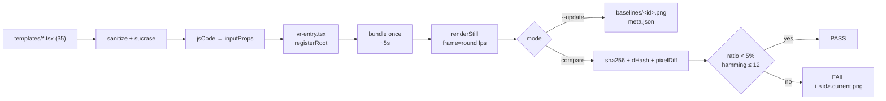

# TM-75 — 35 템플릿 visual-regression 박제

## 한 줄 요약

35 템플릿의 1초(=fps frame) 시점 PNG를 baseline으로 commit, 매 PR 마다 `npm run test:visual-regression` 으로 sha256 + dHash + 5% 픽셀 diff 자동 검증.

## 산출물

- 코드:
  - `__tests__/visual-regression/run.mjs` — driver (bundle once + renderStill loop)
  - `__tests__/visual-regression/phash.mjs` — sha256 / dHash / pixelDiff (sharp 의존, 신규 deps 0)
  - `__tests__/visual-regression/registry.mjs` — 35 템플릿 메타 (id/file/fps)
  - `__tests__/visual-regression/vr-entry.tsx` — `registerRoot` 호출하는 전용 Remotion entry
  - `__tests__/visual-regression/phash.test.js` — Jest 유닛 (6/6 pass)
  - `__tests__/visual-regression/baselines/<35>.png` + `meta.json`
  - `__tests__/visual-regression/README.md`
- npm scripts:
  - `test:visual-regression` (compare, CI 진입점)
  - `test:visual-regression:update` (baseline 갱신)

## 결정론 검증

baseline 캡처 직후 두 번 연속 compare 모드 실행 → **35/35 EXACT (sha-match=true, diff=0.00%, hamming=0/64)**.
Remotion headless Chrome 출력은 동일 머신에서 byte-for-byte 안정. CI 머신 간 폰트/GPU 지터는 dHash + pixelDiff fallback (5% threshold + Hamming ≤12) 으로 흡수.

## 구조

## 핵심 디자인 결정

1. **dedicated VR entry** — `src/remotion/UniversalComposition.tsx` 는 `registerRoot()` 호출이 없어 standalone bundler 가 거부. 같은 evaluator 를 쓰는 `vr-entry.tsx` 신설하여 export-route 를 건드리지 않음. (사이드 발견: export-route 자체도 현재 깨져 있음 — 별도 task 권장)
2. **in-app loader 동일 파이프라인** — `sanitizeCode` → sucrase → evaluator. 캡처 프레임이 "유저가 실제로 보는 화면" 임을 보장.
3. **sharp 사용 (신규 deps 0)** — pixelmatch / perceptual-hash 라이브러리 도입 대신, 이미 트리에 있는 sharp(@remotion/renderer transitive) 로 9×8 dHash + 64×36 grayscale diff 자체 구현.
4. **threshold 5% + Hamming ≤ 12** — 결정론 baseline 위에서 2중 안전망. CI 폰트 hinting 등 sub-pixel 지터를 흡수하면서도 진짜 회귀는 잡음.

## 알려진 한계 / 후속

- export-route(`src/app/api/export/route.ts`) 는 `UniversalComposition` 을 entry 로 쓰지만 `registerRoot` 미호출 → standalone 시나리오에서는 깨짐. Next dev 서버 안에서만 통하는 우연일 가능성. 별도 fix 필요.
- baseline PNG 35개 합 ~13 MiB (commit 됨). 대다수 < 200 KB; 큰 파일은 1.7 MiB(Particle Field). git LFS 없이 가능 범위.
- frame=fps(1초) 만 캡처 — 애니메이션 후반부 회귀는 못 잡음. 후속에 keyframe sweep(예: 0.5s, 1s, 2s) 옵션 가능.

## 검증

- 단위: `npx jest __tests__/visual-regression/phash.test.js` → 6/6 pass
- 풀스윕 update + compare 2회: 35/35 EXACT, ~50–70s wall-clock

## 관련

- TM-39 회고 follow-up "Lambda 1프레임 + perceptual diff" 의 직접 구현
- ADR-0001 (Edit ≠ Render) — render path 는 여전히 export 시점에만; VR 은 dev/CI 한정 도구
