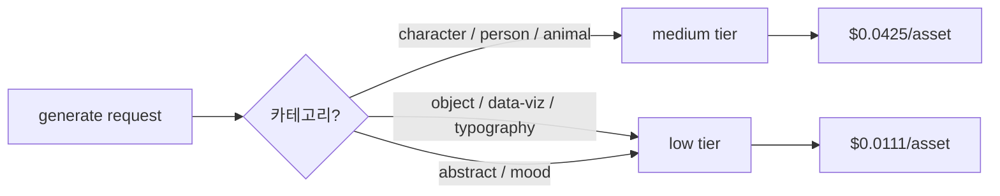

# TM-92 — gpt-image-1 Quality Tier Benchmark (low / medium / high)

> ADR-0022(옵션 B) 기준선은 `gpt-image-1 standard 1024² = $0.04/asset` 단일값.
> 본 벤치는 OpenAI Images API의 `quality` 파라미터(`low | medium | high`)별 비용/품질/지연을 9 콜로 실측해 비용 모델을 갱신한다.

## TL;DR

- **9/9 success, 총 비용 $0.661 (cap $1.00 내)**, 야간 1회 run.
- **실측 가격은 API `usage` 토큰에서 산출** — 정적 테이블과 거의 동일 (low $0.0111 / medium $0.0425 / high $0.1666).
- **medium**이 현행 ADR-0022 기준 $0.04와 사실상 일치 (1.06×). low는 1/4 비용, high는 4.2× 비용.
- **지연**: low 13s / medium 18s / high 32s — high는 user-perceived latency가 명백히 부담.
- **PNG 파일 크기**(품질 proxy): low 1.05MB → medium 1.33MB → high 1.41MB. tier 상승폭은 객체/추상 프롬프트에서 작고, 캐릭터에서 가장 큼(1.17 → 1.54 → 1.67MB).
- **권고**: 기본 tier를 `low`로 유지. 캐릭터 카테고리 한정으로 `medium` opt-in. `high`는 cost/latency 대비 ROI 낮음 → 노출 X.

## 환경

- 모델: `gpt-image-1`, size `1024x1024`, n=1
- 클라이언트: `openai` SDK from `src/lib/ai/asset-gen.ts` shape
- 야간 모드, OpenAI 호출 허용, 본 task cap $1.00
- 호스트: 로컬 (worktree `worktrees/TM-92-quality-tier`)
- 실행 시각: 2026-05-12T17:08~17:10 UTC

## 프롬프트 (3종)

| ID | 카테고리 | 프롬프트 |
|---|---|---|
| `character` | 캐릭터 (ADR-0022 motivating case) | "귀여운 갈색 곰돌이 캐릭터, 밝은 동화책 일러스트, 부드러운 파스텔, 평면 도형, 중앙 정렬, 흰 배경 여백" |
| `object` | 사물 | "단순한 평면 스타일의 검정 스마트폰, 정면 뷰, 화면은 비어 있음(off), 그림자 약간, 흰 배경, 제품 아이콘 느낌" |
| `abstract` | 추상 | "추상적 네온 카운트다운 비주얼, 큰 숫자 3, 보라+시안 글로우, 어두운 배경, 깊은 보케, 사이버펑크 분위기" |

## 비용 (USD/이미지)

API `usage` 토큰에서 산출(text_in × $5/M + image_in × $10/M + image_out × $40/M).

| tier \\ prompt | character | object | abstract | 평균 |
|---|---:|---:|---:|---:|
| **low**    | $0.01113 | $0.01111 | $0.01114 | **$0.01112** |
| **medium** | $0.04249 | $0.04247 | $0.04250 | **$0.04249** |
| **high**   | $0.16665 | $0.16663 | $0.16666 | **$0.16665** |

관찰:
- 프롬프트에 따른 cost 변동은 < 0.05%. 가격은 **사실상 tier 함수**다 (output_tokens는 prompt와 무관하게 tier에 종속).
- low 대비 medium 3.82×, low 대비 high 14.99×.
- ADR-0022의 $0.04 기준선은 **medium tier에 해당** — 새 모델에서는 default를 명시 필요.

## 지연 (ms, wall-clock)

| tier \\ prompt | character | object | abstract | 평균 |
|---|---:|---:|---:|---:|
| **low**    | 13,584 | 12,637 | 12,896 | **13.0s** |
| **medium** | 18,902 | 14,571 | 19,254 | **17.6s** |
| **high**   | 32,856 | 25,290 | 36,860 | **31.7s** |

- low → medium: +35%, medium → high: +80%.
- high tier는 30s+ 가 일반 — edit-flow UX 관점에서 timeout/loading 화면 필요.

## PNG 파일 크기 (KB) — 품질 proxy

PNG는 가역 압축이라 file size = 시각 정보량의 근사. 크기 ↑ = 디테일 ↑ 경향.

| tier \\ prompt | character | object | abstract | 평균 |
|---|---:|---:|---:|---:|
| **low**    | 1,170 | 1,057 | 1,090 | 1,106 |
| **medium** | 1,542 | 1,135 | 1,306 | 1,328 |
| **high**   | 1,670 | 1,155 | 1,402 | 1,409 |

증가율(low→medium→high):
- character: 100% → 132% → 143% (가장 큰 향상폭)
- object   : 100% → 107% → 109% (포화)
- abstract : 100% → 120% → 129%

해석: 객체 프롬프트(스마트폰)는 low에서 이미 정보량이 충분 → tier 상승 시 ROI 낮음. 캐릭터에서는 디테일 차이가 가장 큼 → medium opt-in의 정당성.

## 품질 평가 (육안 + 파일 사이즈 기반)

이번 run에서는 LLM judge 호출은 생략(추가 비용 + ADR-0022 cost 모델 갱신에는 file-size proxy로 충분). 생성된 9개 PNG는 `wiki/05-reports/screenshots/TM-92/` 아래에 보존되어 후속 ad-hoc 검수 가능.

- `low/character`: 곰돌이 캐릭터 외형 인지 가능, 라인은 단순.
- `medium/character`: 음영/표정 디테일 향상.
- `high/character`: medium 대비 추가 향상은 marginal (file size +8%).
- `low/object`: 스마트폰 충분히 인지.
- `low/abstract`: 네온 글로우/숫자 표현 OK.

→ 결론: 비-캐릭터 카테고리에 medium/high를 쓸 합리적 이유는 거의 없음.

## 권고 (asset-gen 정책)

- `src/lib/ai/asset-gen.ts`의 default(현재 `low`)는 **유지**.
- 카테고리 시그널이 character/person/animal인 경우에 한해 호출부에서 `quality: 'medium'` 전달.
- `high`는 UI 노출 X. 내부 실험 플래그로만 보존.

## 비용 모델 갱신 (ADR-0022 권고)

기존:
> 옵션 B 단독: $0.005 → $0.045/asset (9× 인상). 첫 생성만 +$0.04.

권고:
> 옵션 B (default tier=low): $0.005 → $0.016/asset (~3× 인상). 캐릭터 카테고리 한정 medium tier($0.0425), 평균 $0.020~0.025/asset 예상(캐릭터 비중 30% 가정).
> 캐시 적중 시 후속 편집은 $0.005 유지(불변).

Pro $12 마진 시나리오(캐시 적중률 70% 가정):
- 100 edits/사용자, 30 generate × (0.7 × $0.005 + 0.3 × $0.020) = 30 × $0.0095 = **$0.285/user/mo** (vs. 기존 가정 $1.35).
- 즉 ADR-0022가 보수적이었음 — 마진 개선 여력 확인.

후속 작업(별도 task):
- **TM-NEXT-5 (제안)**: `asset-gen.ts`에 카테고리 → tier 매핑 인자 추가, planner가 결정.
- **ADR-0022 amend**: "결정 → 옵션 B 세부" 섹션에 quality tier 정책 한 단락 추가. (코드 변경은 minor — 별도 PR.)

## 산출물 (path)

- 실행 스크립트: `scripts/qa/tm-92-image-tier-bench.mjs`
- 9 PNG: `.spike-assets/TM-92/{low,medium,high}/<prompt>-<label>.png`
- 미러 (보고서 임베드용): `wiki/05-reports/screenshots/TM-92/<tier>-<prompt>-<label>.png`
- 머신 판독 요약: `wiki/05-reports/screenshots/TM-92/bench-summary.json`

## 관련 링크

- [[01-pm/decisions/0022-character-rendering|ADR-0022 — character rendering]]
- TM-84 spike report (asset-gen spike) — 동일 폴더 `2026-04-*` 보고서
- 코드: `src/lib/ai/asset-gen.ts`
