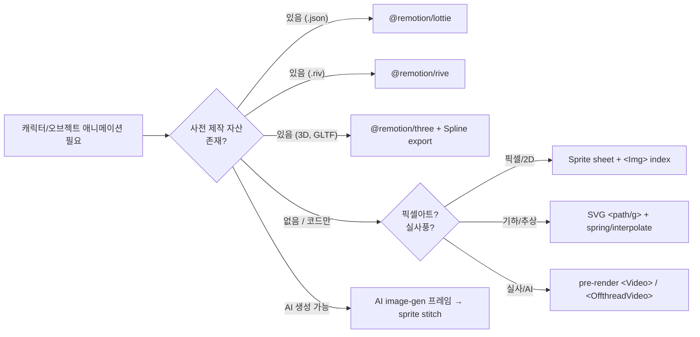

# TM-135 — Remotion 고품질 애니메이션 제작 기법 인벤토리

## TL;DR

- **고품질 모션은 "넓은 도구 매트릭스"의 함수**다 — 단일 기법(SVG + interpolate)에 의존하지 말고, 장면별로 SVG / Lottie / sprite / R3F / pre‑rendered video / Rive 중 적합한 것을 선택해야 한다.
- **즉시 채택할 단기 wins 5가지**: ① `<TransitionSeries>` 도입 ② `@remotion/motion-blur`(Trail/CameraMotionBlur) ③ `@remotion/paths` evolvePath/interpolatePath ④ `@remotion/noise`로 organic motion ⑤ 캐릭터는 SVG 림 + spring(`delay` phase offset) 패턴.
- **메인 RCA(TM-135)와의 관계**: 본 보고서는 _"왜 우리 결과물이 평범한가"_ 의 RCA가 아니라, _"무엇을 더 시도할 수 있는가"_ 의 가능 공간(possibility space) 카탈로그다. RCA는 sibling 문서를 참조.

## 무엇이 바뀌었나 (산출물)

- 본 문서 신규 작성: Remotion 고품질 모션의 7개 기법군 + 즉시 적용 5개 패턴 + 우선순위 표.
- 코드 변경 없음. 신규 dependency 없음 (제안만 포함).

## 왜 / 배경

사용자 요청: _"remotion으로 애니메이션이나 영상을 만드는 좋은 방법 예시 등등등 다양하게 최대한 리서치해봐."_

내부 컨텍스트 (요약):

- ADR-0001 — Edit ≠ Render: edit path는 LLM only. 본 보고서의 모든 기법은 **LLM이 생성하는 코드 컨벤션** 으로 흡수 가능해야 한다.
- ADR-0002 — `PARAMS` auto-extract: 모든 새 기법도 `PARAMS` 컨벤션 깨지 않아야 함.
- ADR-0003 — Prompt caching 안정성: system prompt에 추가 시 cache key 변동 최소화 필요.

따라서 본 보고서의 권고 우선순위는 **"신규 dep 없이 system prompt 한 줄 추가만으로 가능한 것 → 작은 dep 1~2개 → 큰 변경"** 순서.

---

## 1. Remotion 핵심 API & 패턴 (요약 reference)

| 영역 | API | 핵심 포인트 |
|---|---|---|
| Time | `useCurrentFrame()` | 모든 애니메이션 driver. Math.random 금지, `random(seed)` 사용. |
| Time | `useVideoConfig()` | `fps`, `durationInFrames`, `width`, `height` — fps‑independent 코드 작성을 위해 항상 사용 ([multiple-fps](https://www.remotion.dev/docs/multiple-fps)). |
| Tween | `interpolate(frame, [in], [out], {extrapolateLeft:'clamp', extrapolateRight:'clamp'})` | 4번째 인자 clamp는 **거의 항상** 권장 ([interpolate](https://www.remotion.dev/docs/interpolate)). |
| Physics | `spring({frame, fps, config:{damping:200}, delay, durationInFrames})` | `damping=200`은 부드러운 default. `delay` 로 phase offset 가능 ([spring](https://www.remotion.dev/docs/spring), [editor](https://springs.remotion.dev)). |
| Layout | `<AbsoluteFill>`, `<Sequence from durationInFrames>`, `<Series>`, `<Loop>` | 합성/시퀀스/반복. `<Sequence layout="none">` for ThreeCanvas 자식. |
| Transitions | `<TransitionSeries>` + `presentation` (fade/slide/wipe/flip/clockWipe/iris/cube/none) + `timing` (springTiming/linearTiming) | 장면 간 cinematic cut. `springTiming({durationRestThreshold:0.001})` 권장 ([transitionseries](https://www.remotion.dev/docs/transitions/transitionseries)). |
| Render-blocking | `delayRender()` / `continueRender()` / `cancelRender()` | 외부 데이터 로딩 시 필수. |
| Async data | `calculateMetadata()` | duration/dimension을 props 기반으로 동적 결정 (Lottie 길이 자동 매칭 등). |

**Render correctness 룰**: CSS transition 금지 — 모든 animation은 `useCurrentFrame()` 으로부터 도출되어야 한다 ([flickering](https://www.remotion.dev/docs/flickering)).

---

## 2. 공식 템플릿 인벤토리 (https://www.remotion.dev/templates)

| 템플릿 | 용도 | 우리에게 주는 신호 |
|---|---|---|
| Hello World, Blank, JavaScript | starter | — |
| **Next.js (App + Tailwind)** | SaaS scaffold + Player + Lambda | 우리 스택과 동일. 참조 가치 높음. |
| **Three** | R3F + 3D phone with video texture | 캐릭터/3D 시도 시 출발점. |
| **Audiogram / Music Visualization** | 파형 + 자막 | 음성 위주 결과물에 그대로 적용 가능. |
| **Prompt to Motion Graphics** | LLM 코드 생성 starter | 우리와 가장 닮은 템플릿 — 직접 분석 권장. |
| **Prompt to Video** | story + image + voiceover | 우리 narrative pipeline과 유사. |
| **Recorder** | 카메라 녹화 → 자동 캡션 → 편집 | 우리 product 스코프 외. |
| **Skia** | React Native Skia | 고급 그래픽. 무거움. |
| **TikTok** | word-by-word captions | 짧은 폼 영상에 즉시 차용 가능. |
| **Code Hike** | beautiful code animations | 코드 시연 영상. dev tooling 영상에 강함. |
| **Stargazer**, **Overlay** | 특수 도메인 | — |
| Paid: **Editor Starter / Mapbox Globe / Watercolor Map / Timeline** | — | Mapbox Globe는 travel/지도 카테고리에 강력. |

---

## 3. 캐릭터/오브젝트 애니메이션 — 7가지 접근법 비교



### (a) Pure SVG + interpolate/spring — **권장 default**

장점: 0 dep, 무손실 스케일, deterministic, LLM이 생성하기 쉬움.
단점: 복잡한 캐릭터(사람/동물)는 작성 비용 큼.

캐릭터 = `<g>`로 그룹화한 림 + 각 림에 `transform: rotate(...)`을 spring으로 driver. 보행 cycle은 다리에 phase offset:

```tsx
import { spring, useCurrentFrame, useVideoConfig } from "remotion";

const Walker: React.FC = () => {
  const frame = useCurrentFrame();
  const { fps } = useVideoConfig();
  // 좌우 다리에 반대 phase
  const legL = Math.sin((frame / fps) * Math.PI * 4) * 25; // -25..25 deg
  const legR = -legL;
  const bob  = Math.abs(Math.sin((frame / fps) * Math.PI * 4)) * -6; // bob up
  return (
    <svg viewBox="0 0 200 300">
      <g transform={`translate(100 ${150 + bob})`}>
        <circle r="40" fill="#fbbf24" /> {/* head */}
        <rect x="-20" y="40" width="40" height="80" fill="#f59e0b"/> {/* body */}
        <rect x="-15" y="120" width="12" height="60" fill="#92400e" transform={`rotate(${legL} -9 120)`}/>
        <rect x="3"   y="120" width="12" height="60" fill="#92400e" transform={`rotate(${legR}  9 120)`}/>
      </g>
    </svg>
  );
};
```

### (b) Lottie via `@remotion/lottie` — 가장 큰 품질 점프

After Effects → Bodymovin → `.json`. 컴포지션 길이는 `getLottieMetadata()`로 자동 매칭 ([lottie/getlottiemetadata](https://www.remotion.dev/docs/lottie/getlottiemetadata)).

```tsx
import { Lottie, getLottieMetadata } from "@remotion/lottie";
import { staticFile } from "remotion";
// in calculateMetadata: durationInFrames = getLottieMetadata(json).durationInFrames
<Lottie animationData={json} playbackRate={1} loop />
```

주의 ([lottie](https://www.remotion.dev/docs/lottie/)): expressions은 비결정적 frame 결과를 낼 수 있음 → **flickering 검증 필수**. 무료 자산: [lottiefiles.com](https://lottiefiles.com).

### (c) Sprite sheet (PNG strip) — 픽셀/게임 룩

```tsx
const FRAME_W = 64, COLS = 8;
const i = Math.floor(frame / 4) % (COLS * 2);
<div style={{
  width: FRAME_W, height: FRAME_W,
  backgroundImage: `url(${staticFile('walk.png')})`,
  backgroundPosition: `-${(i % COLS) * FRAME_W}px -${Math.floor(i/COLS) * FRAME_W}px`,
  imageRendering: 'pixelated',
}} />
```

### (d) 3D via `@remotion/three` (R3F)

`<ThreeCanvas width={width} height={height}>`로 wrap. **`useFrame` 금지 — 모든 animation은 useCurrentFrame() 기반 declarative** 이어야 함 ([three-canvas](https://www.remotion.dev/docs/three-canvas)). Sequence는 `layout="none"` 필요. Lambda 렌더 시 `chromiumOptions: {gl: "angle"}` 설정.
Spline → R3F export 워크플로우 문서화돼 있음 ([spline](https://www.remotion.dev/docs/spline)).

### (e) Pre-rendered video clips

`<Video>` (from `@remotion/media`, recommended) > `<OffthreadVideo>` (legacy). codec 지원: H.264/265/VP8/VP9/AV1/ProRes. Looping은 `<Loop>` + 길이 측정 패턴 필요 ([offthreadvideo](https://www.remotion.dev/docs/offthreadvideo)).

### (f) AI image-gen frames → sprite stitch

캐릭터 frame 8~24장을 image-gen으로 만들고 sprite로 합쳐서 (c) 패턴 사용. AI tool은 일관성(identity drift) 약점이 있음 → 가능하면 같은 seed + LoRA.

### (g) Rive — `@remotion/rive`

`<RemotionRiveCanvas>` 컴포넌트. Rive는 Lottie보다 인터랙티브하고 state machine 지원. 사전 제작 캐릭터 라이브러리는 적지만 폭발적 성장 중.

---

## 4. 횡스크롤 / Parallax / 카메라 패턴

핵심 아이디어: **여러 `<AbsoluteFill>` 레이어 × 서로 다른 속도의 `translateX` interpolation**.

```tsx
const Parallax: React.FC = () => {
  const frame = useCurrentFrame();
  const { durationInFrames, width } = useVideoConfig();
  const t = (k: number) => interpolate(
    frame, [0, durationInFrames], [0, -width * k],
    { extrapolateRight: 'clamp' }
  );
  return (
    <AbsoluteFill style={{ backgroundColor: '#0c1424' }}>
      <AbsoluteFill style={{ transform: `translateX(${t(0.3)}px)` }}>
        
      </AbsoluteFill>
      <AbsoluteFill style={{ transform: `translateX(${t(0.6)}px)` }}>
        
      </AbsoluteFill>
      <AbsoluteFill style={{ transform: `translateX(${t(1.0)}px)` }}>
        <Walker />
      </AbsoluteFill>
    </AbsoluteFill>
  );
};
```

추가 아이디어:

- **Camera follow**: world에 negative translate를 적용 (camera === inverse-world)
- **Z‑depth perspective**: `perspective(1000px) translateZ(...)` + `transform-style: preserve-3d`
- **Camera shake**: `noise2D('shake-x', 0, frame*0.1) * 4` 로 미세 흔들림
- **Motion blur**: `<CameraMotionBlur shutterAngle={180} samples={8}>` (children은 absolutely positioned 필수, `useCurrentFrame()`은 자식 컴포넌트 내부에서만 — common-mistake 페이지 참조 [motion-blur/common-mistake](https://www.remotion.dev/docs/motion-blur/common-mistake))
- **Trail (afterimage)**: `<Trail layers={50} lagInFrames={0.3} trailOpacity={1}>` ([motion-blur/trail](https://www.remotion.dev/docs/motion-blur/motion-blur))

---

## 5. 다른 motion 도구와의 hybrid

| 외부 도구 | Remotion 통합 | 가치 |
|---|---|---|
| **After Effects** | Bodymovin export → `@remotion/lottie` | 디자이너 자산 직수입 — 품질 최고 |
| **Spline** (browser 3D) | export to R3F → `@splinetools/r3f-spline` + `@remotion/three` | code-only 3D 가능 ([spline](https://www.remotion.dev/docs/spline)) |
| **Figma** | export SVG → `@remotion/paths` 로 evolve/interpolate | UI 시안 → 모션 |
| **Manim** (Python) | render mp4 → `<OffthreadVideo>`로 합성 | 수학 시각화 niche |
| **Rive** | `.riv` → `@remotion/rive` | 인터랙티브 캐릭터/UI |
| **GSAP / framer-motion** | ❌ 권장 안 함 — useCurrentFrame() 기반이 아니어서 flickering 위험 | 대신 spring/interpolate로 동등 표현 가능 |
| **Three.js scenes** | R3F로 변환해 ThreeCanvas 안에 | 3D 씬 풀스택 |
| **anime.js** | ❌ 같은 이유 | — |

**핵심 룰**: 모든 motion은 frame-deterministic이어야 한다. RAF 기반 라이브러리는 record 시 flickering.

---

## 6. AI 코드 생성 + Remotion 품질 확보 패턴

### 6.1 공식 system prompt (Remotion 팀 제공)

[https://www.remotion.dev/docs/ai/system-prompt](https://www.remotion.dev/docs/ai/system-prompt) — `https://www.remotion.dev/llms.txt`에서도 raw로 받을 수 있음. **우리 system prompt와 diff를 떠 보고 누락된 룰 추가**할 것 (특히 random/Sequence/Series/Transitions 사용 룰).

### 6.2 좋은 prompt vs 나쁜 prompt

```
❌ "Make a cool video of a dog running"
✅ "Make a 6-second 1920x1080 30fps Remotion composition called DogRun.
   Layout: Series with 3 Series.Sequence (1.5s hook, 3s main, 1.5s outro).
   Hook: title text fade-in via spring(damping:200). Main: parallax with
   3 background layers (mountains, hills, ground) translating at speeds
   0.3/0.6/1.0; foreground SVG dog with 4-leg phase-offset walking cycle
   (sin wave on rotation transform). Outro: fade to black via TransitionSeries.
   Export PARAMS = { title, dogColor, bgPalette, walkSpeed }."
```

### 6.3 system prompt 안 visual rubric (제안)

```
SCENE QUALITY CHECKLIST (must satisfy ≥3 to score "good"):
[ ] foreground/midground/background depth (≥2 layers)
[ ] character/subject has internal motion (limbs, parts, scale)
[ ] motion arc uses spring() or interpolate() not linear-only
[ ] timing has hook (0-1s) + body + outro structure (Series or TransitionSeries)
[ ] color palette ≥3 hues, harmonized (not all neutrals)
[ ] camera intent: pan, zoom, parallax, or shake (not static)
```

이 rubric을 (a) generation prompt 부록 + (b) judge agent 평가 prompt 양쪽에 동일 텍스트로 넣으면 alignment 향상 ([cf. TM-66 visual judge](https://github.com/anthropics/...)).

### 6.4 다른 OSS 사례

- **Bolt.new** ([bolt](https://www.remotion.dev/docs/ai/bolt)) — Remotion 공식 통합. 실시간 LLM 코드생성 + 미리보기.
- **template-prompt-to-motion-graphics** — Remotion 공식 starter ([templates/prompt-to-motion-graphics](https://www.remotion.dev/templates/prompt-to-motion-graphics)).
- **template-prompt-to-video** — story + image + voiceover ([templates/prompt-to-video](https://www.remotion.dev/templates/prompt-to-video)).

---

## 7. Examples 갤러리 — 사용자에게 보여줄 만한 결과물

| # | 작품 | URL | 핵심 기법 |
|---|---|---|---|
| 1 | **GitHubUnwrapped** (2022~2025) | [githubunwrapped.com](https://githubunwrapped.com) | Reactive Player, 사용자별 dynamic data, multi-scene Series, particle/3D 혼합 — 가장 유명한 reference app |
| 2 | **Remotion 공식 demo reel** | [remotion.dev](https://www.remotion.dev/) (홈 hero) | TransitionSeries, motion-blur, 3D, type animation 종합 |
| 3 | **#GitHubWrapped open source repo** | [github.com/remotion-dev/github-unwrapped-2024](https://github.com/remotion-dev/github-unwrapped-2024) | 실제 production 코드 — 학습 가치 최상 |
| 4 | **Audiogram template** | [template-audiogram-1nrh.vercel.app](https://template-audiogram-1nrh.vercel.app) | 음성 + 파형 + 캡션 |
| 5 | **3D template (phone with video texture)** | [github.com/remotion-dev/template-three](https://github.com/remotion-dev/template-three) | R3F + useVideoTexture |
| 6 | **Mapbox Globe (paid)** | [remotion.pro/mapbox-globe](https://www.remotion.pro/mapbox-globe) | 지도 회전/줌 — travel/news intro에 강력 |
| 7 | **Spline + Remotion 토러스** | [remotion.dev/docs/spline](https://www.remotion.dev/docs/spline) tutorial | Spline 3D → R3F export → spring rotation |
| 8 | **TikTok captions template** | [templates/tiktok](https://www.remotion.dev/templates/tiktok) | word-by-word caption animation |
| 9 | **Code Hike template** | [templates/code-hike](https://www.remotion.dev/templates/code-hike) | code typing/highlight animations |
| 10 | **awesome-remotion list** | [github.com/remotion-dev/remotion/discussions](https://github.com/remotion-dev/remotion/discussions) | 커뮤니티 작품 모음 |

---

## 8. 우리 프로젝트에 즉시 적용 가능한 5개 패턴 (코드 sketch)

### Pattern A — 3-Act Structure with TransitionSeries

```tsx
import { TransitionSeries, springTiming } from "@remotion/transitions";
import { fade } from "@remotion/transitions/fade";

export const PARAMS = { title: "Hello", color: "#3b82f6", duration: 6 };

export const Story: React.FC<typeof PARAMS> = ({title, color}) => (
  <TransitionSeries>
    <TransitionSeries.Sequence durationInFrames={45}><Hook title={title}/></TransitionSeries.Sequence>
    <TransitionSeries.Transition presentation={fade()} timing={springTiming({config:{damping:200}, durationRestThreshold:0.001})}/>
    <TransitionSeries.Sequence durationInFrames={120}><Body color={color}/></TransitionSeries.Sequence>
    <TransitionSeries.Transition presentation={fade()} timing={springTiming({config:{damping:200}, durationRestThreshold:0.001})}/>
    <TransitionSeries.Sequence durationInFrames={60}><Outro/></TransitionSeries.Sequence>
  </TransitionSeries>
);
```

### Pattern B — 3-Layer Parallax Background (`Parallax` 컴포넌트, 위 §4 참조)

### Pattern C — Walking Character (SVG limbs + phase-offset spring) (위 §3a)

### Pattern D — Path-evolve "draw-on" effect (로고/아이콘 등장)

```tsx
import { evolvePath } from "@remotion/paths";
const p = "M 10 100 C 80 -30 220 -30 290 100"; // any SVG path
const t = spring({frame, fps, config:{damping:200}});
const { strokeDasharray, strokeDashoffset } = evolvePath(t, p);
<svg viewBox="0 0 300 200">
  <path d={p} stroke="white" strokeWidth={6} fill="none"
    strokeDasharray={strokeDasharray} strokeDashoffset={strokeDashoffset}/>
</svg>
```

### Pattern E — Organic camera shake via noise (cinematic feel)

```tsx
import { noise2D } from "@remotion/noise";
const dx = noise2D('cam-x', 0, frame * 0.05) * 8;
const dy = noise2D('cam-y', 0, frame * 0.05) * 6;
const rot= noise2D('cam-r', 0, frame * 0.04) * 0.5;
<AbsoluteFill style={{transform:`translate(${dx}px, ${dy}px) rotate(${rot}deg)`}}>
  {scene}
</AbsoluteFill>
```

---

## 권고 적용 우선순위 (impact × effort)

| 우선순위 | 권고 | Impact | Effort | 신규 dep | ADR 영향 |
|---|---|---|---|---|---|
| **P0** | system prompt에 §6.3 visual rubric 추가 + Remotion 공식 system prompt diff 반영 | 높음 | 1h | 없음 | ADR-0003 cache key 한 번 무효화 |
| **P0** | 모든 결과물에 `<TransitionSeries>` + `springTiming` 권장 (3-act default) | 높음 | 0.5d | `@remotion/transitions` (이미 monorepo에 있을 가능성 높음 — 확인) | 없음 |
| **P1** | `@remotion/paths` evolvePath/interpolatePath 도입 (logo draw-on, path morph) | 중 | 0.5d | `@remotion/paths` | 없음 |
| **P1** | `@remotion/noise` noise2D/3D 도입 (organic motion, camera shake, particle) | 중 | 0.5d | `@remotion/noise` | 없음 |
| **P1** | 캐릭터 walking-cycle SVG limb 패턴을 example 라이브러리에 추가 | 높음 | 1d | 없음 | 없음 |
| **P2** | `@remotion/motion-blur` (Trail, CameraMotionBlur) — cinematic 필요 시 | 중 | 0.5d | `@remotion/motion-blur` | 없음 (samples=5~10로 cost 관리) |
| **P2** | `@remotion/lottie` 통합 — 디자이너 자산 / lottiefiles 차용 | 매우 높음 | 2d | `@remotion/lottie`, `lottie-web` | flickering 검증 필요 (테스트 ADR 검토) |
| **P3** | `@remotion/three` (R3F) — 3D 캐릭터/씬 | 높음 | 1주 | three, @react-three/fiber, @types/three, @remotion/three | Lambda chromiumOptions, ADR 신규 |
| **P3** | `@remotion/rive` — interactive 캐릭터 | 중 | 3d | `@remotion/rive` | — |
| **P3** | Mapbox Globe (paid) / Watercolor Map — travel 카테고리 차별화 | 높음 (특정 카테고리에서) | 2d | paid license | ADR 비용 결정 필요 |

---

## 영향

- **코드/시스템**: 본 문서 자체는 무영향. P0~P1 권고 채택 시 `package.json` 의존성 3~4개 증가, system prompt diff 1회.
- **사용자/제품**: 결과물 다양성 + cinematic feel 큰 폭 상승 가능. 특히 §8의 5개 패턴은 단일 PR로도 즉시 차별화.
- **비용/성능**: Lottie/motion-blur는 render cost +10~30% 가능 (samples 수 비례). R3F 도입 시 Lambda chromiumOptions 변경 필수, render time +20~50% 가능.

## 후속 / 다음

- [ ] TM-135 메인 RCA 결과와 cross-reference: 현재 결과물의 _부족_ 이 본 보고서의 어느 카테고리에 매핑되는지 확정 📅 2026-05-16
- [ ] §6.1 공식 Remotion system prompt와 우리 system prompt diff 떠서 격차 페이지 작성 📅 2026-05-17
- [ ] §8 Pattern A~E를 example fixtures로 추가 (LLM training/few-shot용) 📅 2026-05-20
- [ ] P1 dep 3개(`@remotion/paths`, `@remotion/noise`, `@remotion/transitions`) 도입 ADR 검토 📅 2026-05-22
- [ ] Lottie 통합 PoC: `@remotion/lottie`로 1개 캐릭터 임포트 + flickering 검증 📅 2026-05-25

## 출처 / 링크

내부:
- ADR-0001/0002/0003 — `wiki/01-pm/decisions/`
- 메인 RCA: TM-135 sibling 보고서 (별도)
- 시스템 프롬프트 위치: `src/lib/ai/...` (확인 필요)

외부 (모두 [remotion.dev/docs](https://www.remotion.dev/docs)):
- Animating properties: <https://www.remotion.dev/docs/animating-properties>
- interpolate(): <https://www.remotion.dev/docs/interpolate>
- spring(): <https://www.remotion.dev/docs/spring> · editor <https://springs.remotion.dev>
- Multi-fps best practices: <https://www.remotion.dev/docs/multiple-fps>
- TransitionSeries: <https://www.remotion.dev/docs/transitions/transitionseries>
- API overview (모든 패키지): <https://www.remotion.dev/docs/api>
- @remotion/lottie: <https://www.remotion.dev/docs/lottie/> · staticFile loading <https://www.remotion.dev/docs/lottie/staticfile> · metadata <https://www.remotion.dev/docs/lottie/getlottiemetadata>
- @remotion/three: <https://www.remotion.dev/docs/three> · ThreeCanvas <https://www.remotion.dev/docs/three-canvas> · video texture <https://www.remotion.dev/docs/videos/as-threejs-texture>
- Spline → R3F: <https://www.remotion.dev/docs/spline>
- @remotion/motion-blur: Trail <https://www.remotion.dev/docs/motion-blur/motion-blur> · CameraMotionBlur <https://www.remotion.dev/docs/motion-blur/camera-motion-blur> · common mistake <https://www.remotion.dev/docs/motion-blur/common-mistake>
- @remotion/noise: <https://www.remotion.dev/docs/noise-visualization> · noise2D <https://www.remotion.dev/docs/noise/noise-2d>
- @remotion/paths: evolvePath <https://www.remotion.dev/docs/paths/evolve-path> · interpolatePath <https://www.remotion.dev/docs/paths/interpolate-path>
- @remotion/shapes: Rect/Circle/Triangle/Ellipse — <https://www.remotion.dev/docs/shapes/rect> 등
- @remotion/transitions presentations: fade/slide/wipe/flip/clockWipe/iris/cube — <https://www.remotion.dev/docs/transitions/presentations>
- @remotion/captions: <https://www.remotion.dev/docs/captions> · TikTok-style <https://www.remotion.dev/docs/captions/create-tiktok-style-captions>
- @remotion/rive: <https://www.remotion.dev/docs/rive/remotionrivecanvas>
- Visual editing / visualControl(): <https://www.remotion.dev/docs/visual-editing> · <https://www.remotion.dev/docs/studio/visual-control>
- AI / system prompt: <https://www.remotion.dev/docs/ai/> · <https://www.remotion.dev/docs/ai/system-prompt> · llms.txt <https://www.remotion.dev/llms.txt>
- Templates index: <https://www.remotion.dev/templates>
- Player: <https://www.remotion.dev/player> · docs <https://www.remotion.dev/docs/player/>
- Reference app: <https://githubunwrapped.com> · source <https://github.com/remotion-dev/github-unwrapped-2024>
- Asset libraries: <https://lottiefiles.com> · <https://rive.app>
