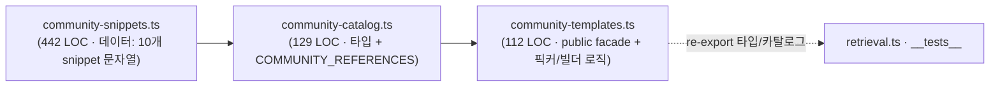

# Refactor Week 3 — src/lib 모듈 응집도 점검 (TM-183)

## TL;DR

- `src/lib` god-module 베이스라인을 madge + dependency-cruiser 로 측정 → 최대 god-module 후보 5건 식별.
- TM-182(generate/pipeline) · TM-185(prompts/sandbox) 와의 머지 충돌을 피해 **충돌 위험이 없는** `community-templates.ts`(650 LOC) 1건만 보수적으로 분해 — data/catalog/logic 3-파일 split, **public surface 불변, behavior-preserving**.
- 나머지 god-module(retrieval, evaluator, transpiler 등)은 follow-up task 로 분리. 모든 community/retrieval 테스트(60건) green, 순환 의존 0.

## 베이스라인 의존성 리포트 (madge / depcruise)

측정 명령:
```bash
npx madge --extensions ts,tsx --circular src/lib     # 순환 의존
npx madge --extensions ts,tsx --summary  src/lib     # fan-in 요약
npm run check:circular                               # depcruise (.dependency-cruiser.cjs)
```

### 순환 의존

```
✖ Found 1 circular dependency!
1) ai/generate.ts > ai/pipeline.ts
```

- 유일한 순환은 `generate.ts ↔ pipeline.ts` — **TM-182 진행 영역이라 본 라운드에서 손대지 않음**(충돌 회피). follow-up 으로 남김.
- depcruise: `✔ no dependency violations found (241 modules, 652 dependencies cruised)`.

### 과대 파일 (LOC top, baseline)

| 파일 | LOC | lib-내 fan-in | 비고 |
|---|---:|---:|---|
| `ai/pipeline.ts` | 1539 | 6 | **TM-182 — skip** |
| `ai/generate.ts` | 1390 | 13 | **TM-182 — skip** (순환 한쪽) |
| `ai/prompts.ts` | 948 | 1 | **TM-185 — skip** |
| `ai/community-templates.ts` | **650** | 1 (retrieval) | ✅ **본 라운드 처리** |
| `remotion/sandbox.ts` | 559 | 0 | **TM-185 — skip** |
| `ai/retrieval.ts` | 467 | 1 | follow-up 후보 |
| `templates.ts` | 419 | 0 | 저우선(이미 응집) |
| `ai/clarify-questions.ts` | 373 | 1 | follow-up 후보 |
| `remotion/evaluator.ts` | 342 | 0 | follow-up 후보 |

### 우선순위화 (impact × effort)

`community-templates.ts` 가 **유일하게 high-impact / low-effort / zero-conflict** 교집합:
- 650 LOC 중 ~430 LOC 이 inline snippet 문자열 상수(순수 데이터)와 logic 이 한 파일에 혼재 → 전형적 low-cohesion god-module.
- lib-내 의존자는 `retrieval.ts` 1곳 + 테스트 3건뿐 → 표면 변경 없이 안전 분해 가능.
- TM-182/185 영역과 완전히 분리 → 머지 충돌 위험 0.

## 무엇이 바뀌었나

`src/lib/ai/community-templates.ts` (650 LOC) 를 **응집도 기준 3파일로 분해**:



- **`community-snippets.ts`** — 10개 exemplar 코드 문자열 상수만(`CHARACTER_SCENE` … `SEQUENCE_COMP`). 순수 데이터, 런타임 로직 없음.
- **`community-catalog.ts`** — `CommunityCategory` / `CommunityReference` 타입 + `COMMUNITY_REFERENCES` 카탈로그(snippet import).
- **`community-templates.ts`** — 슬림 facade: 타입·카탈로그 re-export + `pickCommunityReferenceForPrompt` / `buildCommunityReferenceBlock` 로직 유지. **import 경로(`@/lib/ai/community-templates`) 와 export 표면 완전 불변.**

## 왜 / 배경

P2 refactor 크론(TM-94 자동생성) week 3 주제 = `src/lib` 응집도. god-module 은 변경 영향 추적을 어렵게 하고(데이터 변경 ↔ 로직 변경 구분 불가) PR diff 노이즈를 키운다. 단, 동시 진행 중인 TM-182/185 와 같은 파일을 건드리면 머지 충돌이 확정적이라, **충돌 가능성 0인 단일 god-module 만 보수적으로** 처리.

## 영향

- **코드/시스템**: behavior-preserving refactor only. 기능 동작 변경 없음. `COMMUNITY_REFERENCES`, `pickCommunityReferenceForPrompt`, `buildCommunityReferenceBlock`, 타입 모두 동일 경로로 노출.
- **검증**:
  - `npx jest community-templates retrieval tm-74-live-validate` → **60 passed, 5 skipped, 0 fail**.
  - `npx tsc --noEmit` → src/lib 0 error (기존 `plugin/*` 의 무관한 pre-existing error 만 잔존).
  - `npm run check:circular` → `no dependency violations (241 modules)`.
  - eslint(신규 3파일) → clean.
  - `__tests__/lib` 전체 중 `remotion/{evaluator,evaluator-fuzz,denylist-sync}` 3건 실패는 **baseline(HEAD 990980d)에서도 동일 실패**하는 `@remotion/lottie` ESM transform 환경 이슈로, 본 변경과 무관(stash 후 재현 확인).
- **비용/성능**: prompt-cache key 안정성(ADR-0003) 영향 없음 — 프롬프트 생성 로직·문자열 내용 무변경.

## 후속 / 다음 (spawned_tasks)

본 라운드 timebox 내 미처리 god-module — follow-up task 로 분리(TM-97 규약: 워크트리 add-task 금지, Orchestrator promote):

- [ ] **TM-183-spawn-1** — `ai/generate.ts ↔ ai/pipeline.ts` 순환 의존 해소. TM-182 머지 완료 후 착수(충돌 회피).
- [ ] **TM-183-spawn-2** — `ai/retrieval.ts`(467) catalog/logic 분해 (community-templates 와 동일 패턴 적용).
- [ ] **TM-183-spawn-3** — `remotion/evaluator.ts`(342) 분해: cache / error-classify / build-invoke 책임 분리.

## 출처 / 링크

- 코드: `../src/lib/ai/community-templates.ts`, `../src/lib/ai/community-catalog.ts`, `../src/lib/ai/community-snippets.ts`
- 원본 god-module 배경: TM-141 (community RAG)
- 관련 진행: TM-182(generate/pipeline), TM-185(prompts/sandbox) — 충돌 회피 대상
- status 반영: [[../02-dev/status]]
