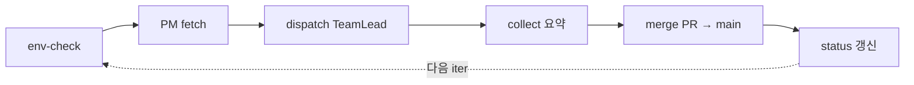

# TM-213 — durable-execution 도입 평가 스파이크

## TL;DR

- Ralph outer iteration(env-check → PM fetch → dispatch → collect → merge → status)을 **journaled durable step**으로 모델링하는 방안(Temporal / Vercel Workflow DevKit)을 평가했다.
- **결론(권고): durable-engine 즉시 도입 보류.** 야간 단일-호스트 루프에는 경량 로컬 패턴(#1 progress-ledger TM-205 + #2 phase checkpoint/resume TM-206)이 crash-safety 갭의 대부분을 저비용으로 메운다. 이는 [[../01-pm/decisions/0030-orchestrator-v2-hardening|ADR-0030]]에서 이미 내린 보류 결정을 뒷받침·구체화하는 스파이크다(신규 ADR 없음).
- **조건부 트리거 명시**: (a) 실행이 다중 호스트로 분산되거나, (b) ledger+checkpoint를 도입하고도 작업유실이 월 2회 이상 지속되면 TM-211에서 durable-engine 도입을 재평가한다.

## 왜 / 배경

야간 overnight quality loop(메모리: `feedback_overnight_quality_loop.md`)를 장시간 자율로 돌리면서, 3-tier Ralph 루프(Orchestrator → PM → TeamLead → build-team)의 **crash-safety 갭**이 반복 관측됐다. 이는 단발 버그가 아니라 루프 설계 차원의 문제이며, 산업계의 검증된 해법 중 하나가 durable-execution 엔진(Temporal, Vercel WDK)이다. 본 스파이크는 "그 엔진을 지금 도입할 것인가"를 코드 변경 없이 평가하고, ADR-0030의 보류 결정에 구체적 근거와 재평가 조건을 부여하는 것이 목적이다.

상위 리서치 합본은 [[2026-06-05-orchestrator-v2-research|Orchestrator v2 하드닝 리서치 합본(TM-204)]]를 참조. 본 리포트는 그중 **#7 durable-engine(TM-211 보류)** 레버만 깊게 파고든다.

## 현 Ralph 루프의 crash-safety 갭 (이번 세션 관측)

Ralph outer iteration의 한 사이클은 다음 6 step의 순차 실행이다. 각 step은 LLM 호출·파일 IO·git 작업·서브프로세스를 섞은 **부수효과(side-effect)** 덩어리이고, 어디에도 journaled 경계가 없다.

이번 세션에서 직접 관측된 3종 실패 모드:

1. **TeamLead long-turn stall** — dispatch된 TeamLead가 단일 long-turn으로 Phase A→F를 끌고 가다 무응답/루프에 빠지면, 진행 상태가 어디에도 체크포인트되지 않아 **작업이 통째로 유실**된다. 재시작은 from-scratch. 외부 진척 원장이 없어 stall 탐지 자체가 늦다. (= 약점 ①, ⑤)
2. **pull/merge abort** — `merge` step 도중(예: `git fetch`/rebase 중) 프로세스가 중단되면, "PR은 머지됐는데 status는 미갱신" 또는 "main pull이 절반만 적용된" 부분상태가 남는다. step 경계가 idempotent하게 journaling되지 않아 재진입 시 어디서 다시 시작할지 모호하다.
3. **머지 충돌 thrash** — 병렬 iter의 wiki/tasks.json 동시쓰기로 충돌이 나면, 같은 머지를 반복 시도하며 토큰을 태운다(= 약점 ②와 결합). 충돌 해소 진척이 journaling되지 않아 매 재시도가 처음부터.

공통 근본 원인: **step별 journaled 경계(durable step)와 멱등 재진입(idempotent resume)이 없다.** 이것이 durable-execution이 정확히 겨냥하는 문제 영역이다.

## 비교: durable-engine 2종 vs 경량 로컬

세 가지 접근을 비용 / 벤더 락인 / 구현부하 / 이득(우리 루프 기준)으로 비교한다.

| 항목 | **Temporal** | **Vercel Workflow DevKit (WDK)** | **경량 로컬 (#1 ledger TM-205 + #2 checkpoint TM-206)** |
|---|---|---|---|
| 모델 | Workflow + Activity, event-sourced 결정론 재생(replay). 외부 워커가 history를 재생해 상태 복원 | `"use workflow"` / `"use step"` 함수 경계, step별 결과 영속 + auto-retry, **배포를 넘나드는 pause/resume** | append-only JSONL progress-ledger(Magentic-One 패턴) + phase별 checkpoint 파일(LangGraph persistence 패턴) |
| crash-safe resume | ◎ 강함 — history replay로 정확한 지점 복원 | ◎ 강함 — 완료된 step 스킵, 미완 step부터 | ○ 중간 — 마지막 checkpoint phase부터 resume, phase 내부 부분진행은 재실행 |
| step별 auto-retry | ◎ 정책 기반(backoff/timeout) 내장 | ◎ step 단위 자동 retry | △ 직접 구현(우리 SOP의 escalate/재시도 로직) |
| 인프라/운영비용 | **높음** — Temporal Server(self-host) 또는 Temporal Cloud 유료 구독 + 워커 프로세스 상시 가동 | **중간** — Vercel 플랫폼 종속, 워크플로 실행 과금 | **낮음** — 로컬 파일(JSONL/JSON)만, 상시 서버 0 |
| 벤더 락인 | 중간(오픈소스지만 SDK·서버 모델에 결합) | **높음** — Vercel 런타임/배포 모델에 강결합 | **없음** — 표준 파일, 어디서나 동작 |
| 구현부하(우리 코드) | **높음** — Orchestrator/TeamLead 런타임을 Workflow/Activity로 재작성, 결정론 제약(비결정 코드 격리) 준수 | **높음** — Next.js/Vercel 런타임 위로 루프 이식, `"use step"` 경계 재설계 | **낮음~중간** — `.agent-state/`에 ledger append + phase checkpoint write, stall 워치독 추가. 기존 SOP에 증분 |
| 단일-호스트 야간 루프 적합도 | 과함(overkill) — 분산·고가용 워크플로가 본령 | 과함 + 런타임 미스매치(우리는 로컬 CLI 루프, Vercel 서버리스 아님) | **적합** — 단일 호스트·순차 루프에 정확히 맞음 |
| 주된 이득 | 극단 장애에서도 정확한 resume, 대규모 분산 | 배포 교체 중에도 pause/resume, 관리형 retry | 작업유실의 대부분 차단 + stall 조기탐지, 비용 거의 0 |

### 핵심 판단

- 우리가 겪는 손실(stall 유실·merge abort 부분상태·충돌 thrash)의 **80%는 "phase 경계 journaling + 멱등 resume + stall 탐지"만으로 막힌다.** 이는 경량 로컬(#1+#2)의 정확한 사정거리다.
- durable-engine이 추가로 주는 것은 (i) phase **내부** 세밀 step의 정확 복원, (ii) 관리형 retry/backoff, (iii) 분산·고가용. 현재 루프는 **단일 호스트·순차 실행**이라 (iii)의 가치가 0에 가깝고, (i)(ii)는 ledger/checkpoint+기존 escalate 로직으로 충분히 근사된다.
- 반면 도입 비용은 비대칭적으로 크다: 런타임 재작성(결정론 제약 또는 Vercel 런타임 이식), 상시 서버/플랫폼 종속, 벤더 락인. 즉시 도입의 ROI가 음수다.

## 권고

**durable-engine 즉시 도입 보류 — 경량 로컬(#1 progress-ledger + #2 phase checkpoint/resume)을 먼저 도입한다.** 이는 ADR-0030 결정(대안 C: 점진 강화)과 동일하며, 본 스파이크는 그 보류에 정량 근거와 재평가 조건을 부여한다.

### 조건부 도입 트리거 (TM-211 재평가)

아래 중 **하나라도** 충족되면 durable-engine(우선 Temporal — 락인이 WDK보다 낮고 런타임 가정이 자유로움) 도입을 재평가한다:

1. **다중 호스트 분산 실행** — Ralph 루프가 단일 호스트를 벗어나 여러 워커/머신에 분산되면, 경량 로컬 파일 ledger로는 일관성 보장이 어려워진다. 이 시점에서 durable-engine의 본령(분산·고가용 워크플로)이 비로소 ROI를 낸다.
2. **잔존 작업유실률 임계 초과** — #1 ledger + #2 checkpoint를 도입하고도 **작업유실이 월 2회 이상** 지속 관측되면(ledger의 stall/lost 카운터로 측정), 경량 패턴의 한계로 판단하고 durable-engine 도입을 재고한다.
3. (보조) 배포 교체 중 장시간 워크플로 중단이 빈번해지면 WDK의 cross-deploy pause/resume을 별도 평가.

> 측정 가능성 전제: TM-205 progress-ledger가 phase 전환·stall·lost 이벤트를 append-only로 기록하므로, 위 트리거 2의 "월 N회"는 ledger 집계로 객관 측정된다. 트리거는 직감이 아니라 데이터로 발동한다.

## 영향

- 코드/시스템: **변경 0(docs only).** orchestrate.md / team-lead.md / scripts 미접촉(충돌 회피). 후속 TM-205/206이 경량 패턴을 구현하고, TM-211은 위 트리거 충족 시까지 보류 상태 유지.
- 제품: 간접 — 야간 자율 루프의 작업유실 감소가 실효 처리량으로 환원되나, 본 task 자체는 권고 리포트.
- 비용/성능: durable-engine 보류로 상시 서버/구독/락인 비용 회피. 경량 로컬은 파일 IO만이라 런타임 오버헤드 무시 가능.

## 후속 / 다음

- [ ] TM-205 progress-ledger + stall 워치독 구현(트리거 2의 측정 인프라 겸함) 📅 2026-06-12
- [ ] TM-206 phase checkpoint/resume 구현
- [ ] TM-211 durable-engine 재평가는 **위 조건부 트리거 충족 시에만** 발동 (그 전까지 보류 유지)

## 출처 / 링크

- 결정(보류): [[../01-pm/decisions/0030-orchestrator-v2-hardening|ADR-0030 Orchestrator v2 하드닝]] (대안 C 점진 강화, durable-engine 보류)
- 상위 리서치: [[2026-06-05-orchestrator-v2-research|Orchestrator v2 하드닝 리서치 합본(TM-204)]]
- Temporal — durable execution: https://temporal.io/ , 개념: https://docs.temporal.io/temporal
- Vercel Workflow DevKit — Introducing Workflow: https://vercel.com/blog/introducing-workflow-development-kit , 문서: https://vercel.com/docs/workflow
- LangGraph — persistence(checkpointers): https://langchain-ai.github.io/langgraph/concepts/persistence/
- Microsoft Magentic-One (progress/task ledger 패턴): https://www.microsoft.com/en-us/research/articles/magentic-one-a-generalist-multi-agent-system-for-solving-complex-tasks/
