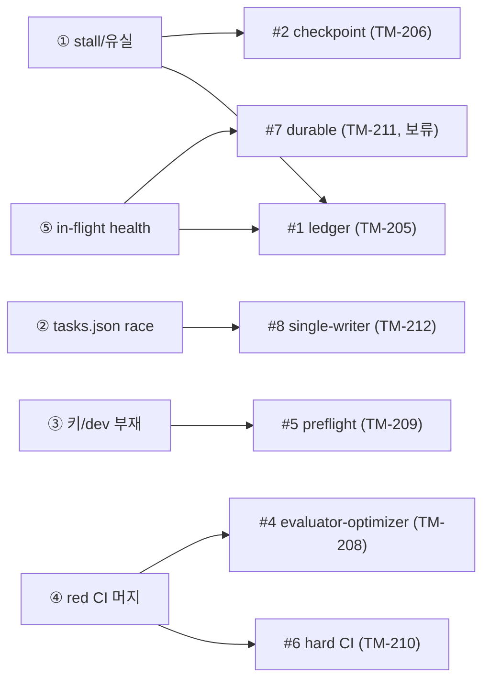

# Orchestrator v2 하드닝 리서치 합본 (TM-204)

## TL;DR

- 우리 3-tier Ralph 루프(PM → TeamLead → build-team)는 동작하지만 **5대 약점**이 야간 자율 모드에서 반복 관측됨: long-turn stall, tasks.json race, 키/dev-server 부재 무처리, 만성 red CI 머지, 느슨한 in-flight health.
- 2026-06-05 외부 리서치(Magentic-One progress ledger, LangGraph checkpoint, OpenAI Swarm guardrails, Hermes tool-calling, evaluator-optimizer self-healing, Temporal/Vercel WDK durable execution)로 **9개 업그레이드 레버**를 도출하고 랭킹·TM 매핑함.
- 결정(→ ADR-0030): **점진 강화(#1/#2/#5/#6/#8 우선)**, durable-engine(Temporal/WDK) **즉시 도입 보류**, GEPA는 **오프라인 전용·live self-modify 금지**.

## 무엇이 바뀌었나

- orchestrator-v2 epic(TM-205~214)의 근거를 위키에 영구 기록.
- 5대 약점 ↔ 9개 레버 ↔ TM 티켓 매핑 확정.
- 하드닝 방향을 ADR로 박제(durable-engine 보류, GEPA 오프라인 전용 가드).

## 왜 / 배경

야간 overnight quality loop(메모리: `feedback_overnight_quality_loop.md`)를 장시간 자율로 돌리면서, 단발 버그가 아니라 **오케스트레이션 구조 자체의 반복 실패 모드**가 드러났다. 코드 패치가 아니라 루프 설계 차원의 하드닝이 필요하다. 본 리서치는 산업계 멀티에이전트 오케스트레이터의 검증된 패턴을 우리 루프에 매핑하는 것이 목적이다.

## 관측된 5대 약점

### ① TeamLead 단일 long-turn stall / 작업유실
하나의 TeamLead 세션이 Phase A→F를 단일 long-turn으로 끌고 가다 중간에 stall(무응답/루프)하면, 진행 상태가 어디에도 체크포인트되지 않아 **작업이 통째로 유실**된다. 재시작 시 처음부터. 진척 추적용 외부 원장(ledger)이 없어 stall 탐지 자체가 늦다.

### ② tasks.json 동시쓰기 race + int/str id 혼용
병렬 iter에서 여러 세션이 canonical `.taskmaster/tasks/tasks.json`을 동시 갱신 → race. 추가로 task id가 정수(`82`)와 문자열(`"TM-82"`)로 혼용돼 dependency 매칭/조회가 깨진다. TM-97 retro에서 이미 "scheduler가 TM-82 라벨로 spawn → 실제 TM-82는 character-rendering" 사고 기록됨. 현재는 worktree add-task 금지 + 단일 promote 직렬화로 우회 중이나, **writer가 구조적으로 단일화돼 있지 않다**.

### ③ API키 / dev-server 부재 무처리
키 누락 또는 dev-server(포트) 미기동 상태에서 teammate가 그대로 진행 → 의미 없는 실패를 길게 반복하거나, 빈 결과를 "성공"으로 오인. 시작 전 **preflight 게이트가 없어** 실패를 늦게(혹은 못) 감지.

### ④ 만성 red CI 무시 머지
CI가 만성적으로 red인 상태가 normalize 되면서, 새 PR의 red가 "원래 red"에 묻혀 그대로 머지된다. 게이트가 soft(경고)라 회귀가 누적된다.

### ⑤ 느슨한 in-flight health 감시
실행 중 teammate/TeamLead의 health(진행 중인가? 비용 폭주인가? 에러율 급등인가?)를 실시간으로 보는 신호가 약하다. stop-guard가 사후 분석은 하지만, **in-flight 개입(중단/재배정) 신호가 느슨**하다.

## 9개 업그레이드 레버 (랭킹)

| 랭크 | 레버 | 출처 패턴 | 해결 약점 | TM |
|---|---|---|---|---|
| **#1** | progress-ledger + stall 탐지 | Magentic-One progress/task ledger | ① ⑤ | **TM-205** |
| **#2** | phase checkpoint / resume | LangGraph persistence(checkpointer) | ① | **TM-206** |
| **#3** | `execute_code` tool-calling 표준화 | Hermes(hermes-agent) tool-use | (실행 신뢰성) | **TM-207** |
| **#4** | evaluator-optimizer 루프 | self-healing orchestrators | ④ (품질) | **TM-208** |
| **#5** | preflight guardrail | OpenAI Swarm guardrails | ③ | **TM-209** |
| **#6** | hard CI 게이트 | (CI 정책) | ④ | **TM-210** |
| **#7** | durable-engine(**보류**) | Temporal / Vercel WDK | ① ⑤ (장기) | **TM-211** |
| **#8** | 단일-writer (tasks.json) | (단일 writer 직렬화) | ② | **TM-212** |
| **#9** | skill distillation + GEPA(**오프라인**) | GEPA / 프롬프트 최적화 | (장기 품질) | **TM-213** (+ TM-214 메타) |

> 우선순위 근거: ①⑤(stall/health)와 ②(race)가 **작업유실·데이터 정합성**에 직접 닿으므로 #1/#2/#8을 먼저, ③④(preflight/CI)는 **실패 조기 감지**로 #5/#6 동반. #7 durable-engine은 가치는 크나 도입 비용/락인이 커 보류, #9 GEPA는 자기수정 위험 때문에 오프라인 한정.

### 레버 상세

**#1 progress-ledger + stall 탐지 (TM-205)** — Magentic-One은 Orchestrator가 task ledger(목표/사실/계획)와 progress ledger(매 스텝: 진척 여부, 누가 다음, 무엇)를 유지하고, 진척 없음이 임계치를 넘으면 re-plan/stall 핸들링한다. 우리 `.agent-state/`에 append-only progress ledger를 도입해 TeamLead phase 전환을 기록 → stall 워치독이 정체를 조기 탐지.

**#2 phase checkpoint / resume (TM-206)** — LangGraph는 그래프 노드 단위로 state를 checkpointer에 영속화해 crash/중단 후 마지막 체크포인트에서 resume한다. TeamLead Phase A→F를 노드로 보고, 각 phase 완료 시 checkpoint를 남겨 재시작 시 from-scratch가 아닌 resume.

**#3 execute_code tool-calling (TM-207)** — Hermes(hermes-agent) 계열은 구조화된 tool-call 스키마로 코드 실행/검증을 표준화한다. 우리 teammate의 ad-hoc bash를 명시적 `execute_code` tool 인터페이스로 정형화해 실행 신뢰성·관측성 향상.

**#4 evaluator-optimizer (TM-208)** — self-healing orchestrator 패턴: 생성 → 평가(judge) → 실패 시 진단 기반 재생성을 자동 루프. 우리 acceptance gate(ADR-0016)와 결합해 red 결과를 자동 교정.

**#5 preflight guardrail (TM-209)** — OpenAI Swarm은 핸드오프 전후로 input/output guardrail을 실행해 안전·전제조건을 검사한다. 우리 build-team Phase 0 직후 **preflight 게이트**(키 존재? dev-server 기동? 필수 env?)를 추가해 ③를 차단.

**#6 hard CI 게이트 (TM-210)** — PR 머지 전 CI green을 **hard requirement**로. 만성 red는 baseline 스냅샷 대비 "새 red"만 차단하는 게 아니라, red 자체를 머지 차단 사유로 격상.

**#7 durable-engine (TM-211, 보류)** — Temporal / Vercel WDK는 워크플로를 durable하게(step별 영속, 자동 retry, crash-safe resume) 실행한다. #1/#2가 일부 효과를 자체 구현으로 달성하므로 **즉시 도입은 보류**, 운영 안정화 후 재평가.

**#8 단일-writer (TM-212)** — tasks.json에 대한 쓰기를 단일 직렬화 지점(Orchestrator promote)으로 강제하고, id를 `TM-` 접두 문자열로 정규화. ②(race + int/str)를 구조적으로 제거.

**#9 skill distillation + GEPA (TM-213/214, 오프라인)** — GEPA(reflective prompt evolution)로 SOP/스킬 프롬프트를 오프라인에서 최적화·증류. **live self-modify 금지** — 운영 중 에이전트가 자기 프롬프트를 변형하는 것은 폭주 위험(폭주 방지 체크리스트와 충돌)이므로 오프라인 배치 전용.

## 약점 → 레버 → TM 매핑 요약

## 영향

- 코드/시스템: orchestrate.md / team-lead.md / stop-guard.mjs / scripts 의 후속 개정 방향 확정(본 task는 미접촉, 문서만).
- 제품: 야간 자율 품질 루프의 작업유실/회귀 감소 → 실효 처리량 향상.
- 비용/성능: durable-engine 보류로 인프라 비용 증가 회피, ledger/checkpoint는 경량 로컬 파일로 저비용.

## 후속 / 다음

- [ ] TM-205 progress-ledger + stall 워치독 📅 2026-06-12
- [ ] TM-206 phase checkpoint/resume
- [ ] TM-209 preflight guardrail
- [ ] TM-210 hard CI 게이트
- [ ] TM-212 단일-writer 정규화
- [ ] TM-211(durable) 재평가는 위 안정화 이후

## 출처 / 링크

- 결정: [[../01-pm/decisions/0030-orchestrator-v2-hardening|ADR-0030]]
- 블루프린트: [[../02-dev/agent-company-blueprint#Orchestrator v2 하드닝(2026-06-05)]]
- Anthropic — Building a multi-agent research system: https://www.anthropic.com/engineering/built-multi-agent-research-system
- Microsoft Magentic-One (progress/task ledger, orchestrator): https://www.microsoft.com/en-us/research/articles/magentic-one-a-generalist-multi-agent-system-for-solving-complex-tasks/
- LangGraph persistence (checkpointers): https://langchain-ai.github.io/langgraph/concepts/persistence/
- OpenAI Swarm (guardrails / handoffs): https://github.com/openai/swarm
- Temporal (durable execution): https://temporal.io/
- Vercel Workflow DevKit (WDK): https://vercel.com/docs/workflow
- Nous Research — Hermes / hermes-agent (tool-calling): https://github.com/NousResearch/Hermes-Function-Calling
- Self-healing / evaluator-optimizer orchestrators (arXiv): https://arxiv.org/abs/2402.03620
- GEPA — reflective prompt evolution (arXiv): https://arxiv.org/abs/2507.19457
- 관련 retro: TM-97 (worktree add-task 금지), [[../02-dev/agent-company-blueprint|agent-company-blueprint]]
