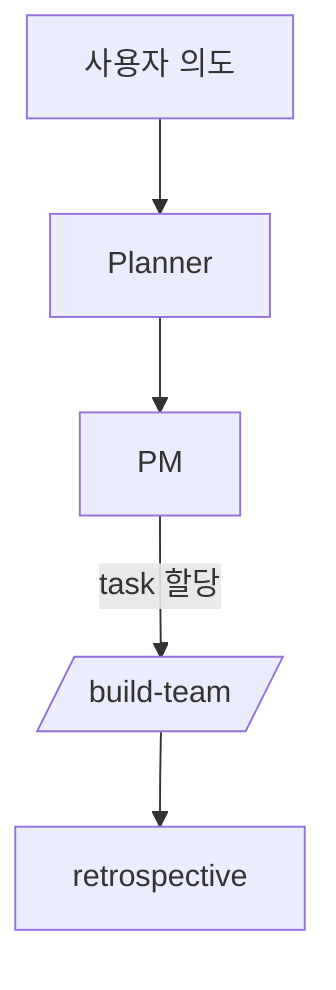

# Wiki Agent Rules — EasyMake

이 파일은 Claude Code가 `wiki/` 디렉토리에서 작업할 때의 **표준 지침**이다.
프로젝트 루트 `CLAUDE.md` / `AGENTS.md`의 코드 규칙은 그대로 유지하고, 이 파일은 **위키 운영 규칙**만 담는다.

## 1. 기본 원칙

- 이 vault는 EasyMake 프로젝트의 **PM + 지식베이스**다. 코드와 함께 Git으로 버전 관리된다.
- 모든 페이지는 평범한 Markdown. 외부 서비스 종속 없음.
- **권위 있는 원본 문서는 함부로 수정하지 않는다**:
  - `../PRD.md` — 제품 요구사항 (수정 시 반드시 사용자 확인)
  - `../docs/superpowers/plans/*` — 구현 플랜 (불변)
  - `../docs/superpowers/specs/*` — 디자인 스펙 (불변)
  - 위 문서는 위키에서 **링크/요약**만 한다.

## 2. 폴더 라우팅 규칙

새 문서를 만들거나 inbox 항목을 분류할 때:

| 내용 유형 | 저장 위치 |
|---|---|
| 빠른 메모, 떠오른 아이디어 | `00-inbox/YYYY-MM-DD-slug.md` |
| 제품 요구사항 변경/논의 | `01-pm/` (PRD 자체는 수정 X, 변경 제안은 별도 노트) |
| 로드맵, 마일스톤 | `01-pm/roadmap.md` |
| 아키텍처/제품 의사결정 | `01-pm/decisions/NNNN-slug.md` (ADR) |
| 회의록 | `01-pm/meetings/YYYY-MM-DD-topic.md` |
| 현재 개발 상황 (live) | `02-dev/status.md` |
| 시스템 아키텍처 | `02-dev/architecture.md` |
| 이슈/작업 단위 | `02-dev/tasks/` 또는 Tasks 플러그인 |
| 트러블슈팅, 학습 노트 | `02-dev/tech-notes/slug.md` |
| 경쟁사 조사, 외부 리서치 | `03-research/slug.md` |
| 더 이상 active하지 않은 문서 | `04-archive/` (삭제 X, 이동) |
| **세션/주간/릴리스/인시던트 보고** | **`05-reports/YYYY-MM-DD-종류-슬러그.md`** |
| 외부 자료 원문 (URL ingest) | `raw/YYYY-MM-DD-domain-slug.md` |

### Reports 폴더에 대해

`05-reports/`는 사용자가 **우선해서 읽는** 보고용 문서 모음이다.
- 작업/세션이 끝나면 status·ADR·tech-notes를 갱신한 뒤, **요약 보고서**를 `05-reports/`에 추가한다.
- 보고서는 정보의 **원본이 아니라 요약**이다 — 디테일은 status/ADR/tech-notes에 두고 보고서에서는 링크.
- 템플릿: `_meta/templates/report.md`. `report_type`은 `session | weekly | release | incident | meeting-summary` 중 하나.

## 3. 페이지 포맷 규칙

모든 페이지는 frontmatter로 시작:

```yaml
---
title: 페이지 제목
created: 2026-04-26
updated: 2026-04-26
tags: [pm, decision]      # _meta/taxonomy.md에 정의된 태그만
status: draft|active|archived
provenance: extracted|inferred|ambiguous   # LLM이 작성한 경우만
---
```

본문 구조: 제목 → 한 줄 요약 → 태그/메타 → 본문 → 관련 링크.

### 시각화 (권장)

문서가 길거나 흐름/관계를 설명할 때는 **텍스트보다 다이어그램**을 우선한다.

| 상황 | 권장 도구 |
|---|---|
| 워크플로우/시퀀스/상태 전환 | **Mermaid 코드블록** (`flowchart`, `sequenceDiagram`, `stateDiagram-v2`) |
| 데이터 모델/관계 | **Mermaid** `erDiagram` 또는 `classDiagram` |
| 시간 축이 있는 일정 | **Mermaid** `gantt` |
| 아키텍처 (3계층 이상) | **Mermaid** `flowchart LR` 또는 `C4Context` |
| UI 시안/실제 화면 | **스크린샷** (`_meta/attachments/`에 저장 후 `![[...]]` 임베드) |
| 단순 표/2~3 항목 비교 | **Markdown 표** |

ASCII art는 단순 트리(3-5줄)에만 허용, 그 외엔 mermaid로.

Obsidian은 Mermaid를 기본 지원하며 GitHub에서도 정상 렌더링된다.

**Mermaid 사용 예시:**

````markdown

````

## 4. 링크 규칙

- 다른 위키 페이지: `[[01-pm/roadmap|로드맵]]` (Obsidian 위키링크)
- 코드 파일: `../src/lib/ai/generate.ts:42` (상대 경로 + 라인)
- 외부 URL: 일반 마크다운 `[제목](url)`
- ADR을 참조할 땐 ID로: `[[01-pm/decisions/0001-edit-not-equal-render|ADR-0001]]`

## 5. 태그

`_meta/taxonomy.md`에 정의된 태그만 사용한다. 새 태그가 필요하면 먼저 taxonomy를 업데이트한다.

## 6. 충돌 해소

여러 소스가 모순될 때:
1. 코드(`../src/`) 현재 상태가 가장 신뢰도 높음
2. 그 다음 PRD.md (제품 의도)
3. 그 다음 ADR (의사결정 기록)
4. 회의록/inbox는 가장 약함
- 모순 발견 시 해당 페이지 frontmatter에 `status: ambiguous` 표시하고 `02-dev/tech-notes/conflicts.md`에 기록

## 7. 자주 쓰이는 슬래시 커맨드 동작 정의

(Claude Code 슬래시 커맨드는 `.claude/commands/` 또는 사용자 정의로 추가)

- **`/ingest <url>`**: URL 본문을 `raw/`에 저장 → 핵심 추출 → 적절한 폴더에 위키 페이지 생성 → 기존 페이지와 cross-link
- **`/process-inbox`**: `00-inbox/` 모든 파일 읽고 분류 규칙 적용 → 이동 + 링크 + 태깅
- **`/lint-wiki`**: 깨진 링크, 고아 페이지, frontmatter 누락, taxonomy 위반 보고
- **`/weekly-status`**: 최근 7일 git log + 새 ADR/회의록 종합해 `02-dev/status.md` 갱신
- **`/adr <title>`**: 새 ADR 생성 (다음 번호 자동 할당, 템플릿 적용)

## 8. 금지사항

- vault 외부의 코드를 멋대로 수정하지 않는다 (별도 작업으로 분리)
- 같은 사실을 여러 페이지에 복제하지 않는다 (한 곳에 두고 링크)
- 사용자 확인 없이 `04-archive/`로 이동하지 않는다
- frontmatter 없이 페이지 생성하지 않는다
